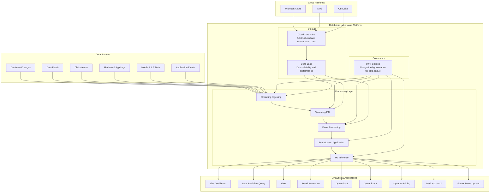
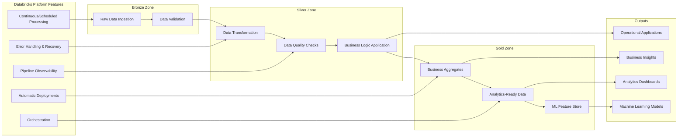
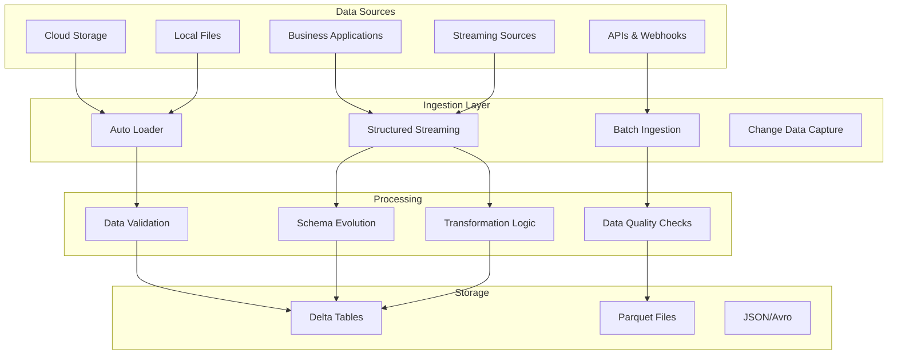

# Databricks Center of Excellence

## Overview
Accion's Databricks Center of Excellence specializes in comprehensive Databricks lakehouse implementations, data platform modernization, and advanced analytics solutions. With 15 certified professionals, 65 trained technical experts, and 30 lakehouses built across 20 clients, we deliver end-to-end Databricks services from greenfield platform builds to complex data migrations and AI/ML implementations.

## Core Credentials & Expertise

### Databricks Partnership
- **Select Partner** status with Databricks
- **15 Certified Professionals** across multiple specializations
- **65 Technical Trained** team members
- **30 Lakehouses Built** for enterprise clients
- **20+ Clients** served across industries
- **5 GenAI Solutions** implemented

### Certification Portfolio
- Databricks Fundamentals
- Lakehouse Fundamentals  
- Platform Architect (AWS & Azure)
- Spark Developer Associate
- Data Engineer Associate
- Data Analyst Associate

## Service Offerings

### 1. Greenfield Data Platform Build and Sustenance
Build comprehensive data platforms from scratch with iterative development and ongoing sustenance.

**Key Activities:**
- Build data platform from scratch
- Gather and understand requirements
- Build comprehensive roadmap
- Iterative build and sustenance of layered data platform
- Build and deliver applications
- Enable data quality and governance

**Deliverables:**
- Requirements gathering and analysis
- Roadmap development
- Layered data platform implementation
- Data quality framework
- Governance policies and procedures

### 2. Data Lake/DW Modernization and Sustenance
Modernize existing data warehouses to Databricks lakehouse with accelerated migration using proven accelerators.

**Key Activities:**
- Gather and understand current and upcoming needs
- Perform fit gap analysis with existing ecosystem
- Prioritize and build migration roadmap
- Iterative accelerated build using accelerators
- Enable downstream compatibility
- Build and deliver applications

**Deliverables:**
- Current state assessment
- Fit gap analysis report
- Migration roadmap and strategy
- Accelerated build using tools
- Downstream compatibility validation
- Application delivery and support

### 3. Advanced Analytics Solution Build and Sustenance
Develop and maintain advanced analytics models and applications integrated with the data platform.

**Key Activities:**
- Curate and build datasets based on applications
- Build analytics models
- Build applications or integrate datasets back into data platform
- Perform sustenance of applications

**Deliverables:**
- Dataset curation and preparation
- Advanced analytics models
- Application development and integration
- Data platform integration
- Ongoing sustenance support

## Databricks Lakehouse Platform Architecture

## Unity Catalog Implementation

### Architecture Components
- **Metastore Management**: Centralized metadata management across workspaces
- **Cross-Workspace Access**: DEV workspace access to DEV and STG catalogs with PRD isolation
- **Admin Delegation**: Separate admin roles for each SDLC environment
- **Storage Isolation**: Catalog-level storage separation for data security
- **Access Control**: Fine-grained user access based on agreed rules

### Key Features
- Cross-workspace data sharing
- Environment-specific governance
- Catalog-level storage isolation
- Role-based access control
- Metadata lineage and discovery

## Modern Data Engineering in Databricks

### Medallion Architecture

### Key Components
- **Bronze Zone**: Raw data ingestion with continuous or scheduled processing
- **Silver Zone**: Cleaned and transformed data with quality validation
- **Gold Zone**: Business-ready aggregates and analytics datasets
- **End-to-end Lineage**: Complete data traceability with Delta Lake
- **Photon Engine**: Accelerated query performance

## Machine Learning and AI Operations

### ML Platform Capabilities
- **Model Building and Training**: Comprehensive ML development environment
- **Model Tracking and Registry**: MLflow integration for model lifecycle management
- **Runtime and Libraries**: Pre-configured environments with popular ML frameworks
- **Automation and Governance**: Automated ML pipelines with governance controls

### Supported Technologies
- TensorFlow, PyTorch, XGBoost, Scikit-learn
- MLflow for experiment tracking and model registry
- Apache Spark for distributed ML training
- AutoML capabilities for automated model development
- Real-time model serving and inference

## Streaming Applications Architecture

### Real-time Processing Capabilities
- **Structured Streaming**: Real-time data processing with exactly-once semantics
- **Event Processing**: Complex event processing for real-time insights  
- **ML Inference**: Real-time model scoring on streaming data
- **Live Dashboards**: Real-time visualization and monitoring

### Use Cases
- Fraud prevention and detection
- Dynamic pricing optimization
- Real-time personalization
- IoT device monitoring and control
- Live dashboard updates

## Data Ingestion and Integration

### Ingestion Patterns

### Key Features
- Self-served data ingestion from multiple sources
- Automated schema detection and evolution
- Data quality validation and monitoring
- Support for structured and unstructured data
- Real-time and batch processing capabilities

## Databricks Workflows Orchestration

### Orchestration Capabilities
- **Multi-platform Integration**: Orchestrate tasks across different platforms
- **Complex Dependencies**: Handle complex workflow dependencies and conditions
- **Error Handling**: Built-in retry logic and error recovery mechanisms
- **Monitoring**: Real-time workflow monitoring and alerting
- **Scalability**: Auto-scaling based on workload demands

### Supported Task Types
- Databricks notebooks and SQL queries
- Delta Live Tables pipelines
- External system integrations
- Machine learning model training and inference
- Data validation and quality checks

## Modernization Methodology

### 5-Phase Approach

#### Phase 1: Discovery
**Duration**: 2-4 weeks
**Activities**:
- Migration-specific discovery and consultation
- Current state assessment
- Stakeholder interviews and requirements gathering

#### Phase 2: Assessment  
**Duration**: 3-6 weeks
**Activities**:
- Technical assessment and design
- Tool selection and accelerator identification
- Resource sizing and capacity planning

#### Phase 3: Strategy
**Duration**: 2-3 weeks
**Activities**:
- Technology mapping and architecture design
- Migration workshop and planning sessions
- Detailed migration strategy development

#### Phase 4: Production Pilot
**Duration**: 4-8 weeks
**Activities**:
- Reference implementation of production use case
- Proof of concept development
- Overall migration implementation plan

#### Phase 5: Execution
**Duration**: 8-16 weeks
**Activities**:
- Full-scale migration execution
- User training and change management
- Ongoing support and optimization

## Success Stories & Case Studies

### Industrial Printers - Brother
**Challenge**: Predictive maintenance and sales forecasting for industrial printing equipment
**Solution**: Databricks Delta Lake, Delta Live Tables, Power BI integration
**Results**: Enhanced predictive maintenance capabilities and improved sales forecasting accuracy

### Leadership Development - DDI  
**Challenge**: Course completion tracking and revenue prediction for leadership programs
**Solution**: Databricks Delta Live Tables, Unity Catalog, Oracle ERP integration
**Results**: Improved course completion rates and accurate revenue forecasting

### Compressor Manufacturing - Atlas Copco
**Challenge**: SAP HANA to Databricks migration for manufacturing data
**Solution**: Databricks Lakehouse, Workflows, Delta Tables, Power BI integration  
**Results**: Modernized data platform with improved analytics capabilities

### Healthcare ATS Platform - Ingenovis Health
**Challenge**: Candidate prioritization and profile matching for healthcare recruitment
**Solution**: Databricks Lakehouse, SQL, Workflows, Unity Catalog, Azure OpenAI integration
**Results**: Enhanced candidate matching and natural language query capabilities

### Financial Services - Community Bank
**Challenge**: Data warehouse migration and modernization
**Solution**: Databricks Lakehouse, Unity Catalog, AWS Redshift, Google BigQuery integration
**Results**: Modernized data warehouse with improved performance and scalability

## Key Metrics & Business Impact

### Performance Metrics
- **Time-to-Insight**: 50-90% reduction in analytics delivery time
- **Data Quality**: Automated validation and continuous monitoring
- **Cost Optimization**: Efficient resource utilization and auto-scaling
- **Platform Unification**: Single lakehouse for all data workloads
- **Real-time Processing**: Sub-second streaming analytics capabilities

### Business Value Delivered
- Unified data and AI platform reducing data silos
- Accelerated analytics delivery and real-time decision making
- Improved data quality through automated validation
- Cost optimization through efficient resource utilization
- Foundation for advanced AI/ML initiatives
- Seamless data sharing across teams and departments

## Technology Stack & Partnerships

### Core Databricks Technologies
- **Databricks Lakehouse Platform**: Unified analytics platform
- **Unity Catalog**: Centralized governance and security
- **Delta Lake**: Reliable data lake storage format
- **Apache Spark**: Distributed data processing engine
- **MLflow**: Machine learning lifecycle management
- **Delta Live Tables**: Declarative ETL framework
- **Databricks SQL**: Analytics and BI workloads
- **Structured Streaming**: Real-time data processing

### Partner Ecosystem
- **Databricks**: Select Partner with deep technical expertise
- **Cloud Platforms**: Microsoft Azure, AWS, Google Cloud Platform
- **Data Integration**: Fivetran, Talend, Azure Data Factory, AWS Glue
- **Visualization**: Power BI, Tableau, Looker
- **Data Governance**: Profisee, Microsoft Purview
- **Data Quality**: TimeXtender, WanDisco

### Programming Languages & Tools
- **Languages**: Python, Scala, SQL, R, Java
- **Frameworks**: PySpark, Spark SQL, TensorFlow, PyTorch
- **Development**: Jupyter Notebooks, Apache Zeppelin, dbt
- **Infrastructure**: Docker, Kubernetes, Terraform
- **APIs**: REST APIs, GraphQL, Apache Kafka

## Getting Started

### Assessment & Discovery
1. **Current State Analysis**: Evaluate existing data infrastructure and challenges
2. **Requirements Gathering**: Identify specific use cases and business objectives  
3. **Technical Assessment**: Review data sources, volumes, and integration requirements
4. **Roadmap Development**: Create phased implementation plan with timeline and milestones

### Implementation Approach
1. **Platform Setup**: Configure Databricks workspace and Unity Catalog
2. **Data Pipeline Development**: Build bronze, silver, and gold layer pipelines
3. **Analytics Development**: Create dashboards, reports, and ML models
4. **User Enablement**: Training and change management for business users
5. **Optimization**: Performance tuning and ongoing platform optimization

### Success Criteria
- **Technical**: Platform performance, data quality, and system reliability
- **Business**: Time-to-insight, user adoption, and ROI achievement
- **Operational**: Automated processes, reduced manual effort, and improved efficiency

## Contact & Next Steps

Ready to modernize your data platform with Databricks? Our certified team of experts is here to guide you through your lakehouse journey.

**Get Started Today:**
1. **Discovery Call**: Schedule a consultation to discuss your specific needs
2. **Technical Assessment**: Receive a customized assessment of your current state
3. **Proof of Concept**: Review a targeted POC demonstrating Databricks capabilities  
4. **Implementation Planning**: Develop a detailed roadmap for your transformation

Our Databricks Center of Excellence brings proven expertise, accelerated delivery, and ongoing support to ensure your success in the modern data landscape.