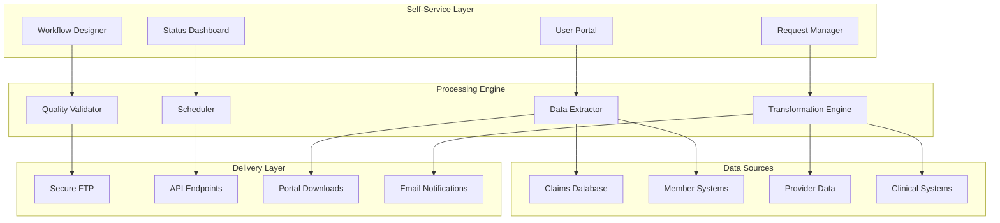

# AxTract - Healthcare Data Mart Framework

## Overview
AxTract is a self-service healthcare data sharing framework with automated scheduling and business user empowerment. This component enables healthcare organizations to efficiently share data with partners while reducing IT dependency and ensuring consistent data delivery workflows.

## Core Capabilities

### Self-Service Data Access
- Business user-friendly interface for data requests
- Automated data extraction and transformation
- Scheduled and on-demand data delivery
- Real-time status tracking and notifications

### Healthcare Data Management
- HIPAA-compliant data handling and security
- Healthcare-specific data transformations
- Partner-specific data formatting
- Quality assurance and validation

### Automated Workflows
- Intelligent scheduling and delivery automation
- Partner-specific workflow configurations
- Exception handling and error recovery
- Comprehensive audit and logging

## Technical Architecture

## Key Features

### Data Transformation Pipelines
- Healthcare-specific data mappings
- Format conversion and standardization
- Data cleansing and validation
- Custom transformation logic

### Automated Scheduling
- Flexible scheduling options (daily, weekly, monthly)
- Event-driven processing triggers
- Holiday and exception calendar support
- Retry logic and failure handling

### Security and Compliance
- End-to-end data encryption
- Access controls and authentication
- HIPAA compliance frameworks
- Audit trails and documentation

## Performance Metrics

### Operational Efficiency
- **IT Backlog Reduction**: 50% fewer data requests to IT
- **Self-Service Adoption**: 75% of data requests self-served
- **Processing Time**: 80% faster data delivery
- **Error Reduction**: 90% fewer data quality issues

### Business Impact
- Reduced operational costs and IT burden
- Faster partner data sharing and collaboration
- Improved data quality and consistency
- Enhanced compliance and audit readiness

## Use Cases

### Healthcare Data Sharing
Share clinical and administrative data with healthcare partners securely.

### PBM Data Distribution
Distribute pharmacy benefit data to pharmacy networks and partners.

### Life Sciences Research
Provide research data to pharmaceutical and biotech partners.

### Provider Network Data Exchange
Share provider network and performance data with stakeholders.

## Technology Stack

### Core Technologies
- **ETL/ELT**: Apache Airflow, Talend, Informatica
- **Databases**: PostgreSQL, Oracle, SQL Server, MongoDB
- **Security**: OAuth 2.0, SAML, AES encryption
- **Scheduling**: Apache Airflow, Quartz, Spring Batch

### Healthcare Integration
- HL7/FHIR data standards
- EDI transaction processing
- Healthcare APIs and interfaces
- Claims processing systems

## Implementation Approach

### Assessment Phase (2-3 weeks)
1. Current data sharing process analysis
2. Partner requirements and formats assessment
3. Compliance and security review
4. Technical architecture design

### Development Phase (8-10 weeks)
1. AxTract platform setup and configuration
2. Data source connections and mappings
3. Transformation logic development
4. User interface and workflow setup

### Testing Phase (4-5 weeks)
1. Data quality and transformation testing
2. Security and compliance validation
3. Partner integration testing
4. User acceptance testing

### Deployment Phase (3-4 weeks)
1. Production deployment and go-live
2. User training and enablement
3. Partner onboarding and validation
4. Monitoring and support setup

## Success Stories

### Large Health Plan
**Challenge**: IT team overwhelmed with 200+ monthly data requests from partners
**Solution**: AxTract self-service platform with automated processing
**Results**: 70% reduction in IT requests, 5x faster data delivery

### Regional PBM
**Challenge**: Manual pharmacy data distribution taking 40 hours weekly
**Solution**: Automated data mart with scheduled partner feeds
**Results**: 95% automation, 2-hour weekly maintenance

## Healthcare Data Types

### Claims Data
- Medical and pharmacy claims
- Eligibility and enrollment data
- Provider and facility information
- Cost and utilization analytics

### Clinical Data
- Lab results and diagnostic data
- Medication and treatment history
- Care management records
- Quality metrics and outcomes

### Administrative Data
- Member demographics and enrollment
- Provider network and contracts
- Financial and billing data
- Compliance and audit information

## Partner Integration

### Data Format Support
- Standard healthcare formats (EDI, HL7, FHIR)
- Custom partner formats and layouts
- CSV, XML, JSON data exports
- Database direct connections

### Delivery Methods
- Secure FTP and SFTP
- RESTful API endpoints
- Encrypted email delivery
- Partner portal access

### Quality Assurance
- Data validation and verification
- Partner-specific quality checks
- Error detection and correction
- Quality reporting and metrics

## Compliance and Security

### HIPAA Compliance
- Administrative, physical, and technical safeguards
- Data encryption in transit and at rest
- Access controls and audit logging
- Business associate agreement support

### Data Governance
- Data lineage and provenance tracking
- Data retention and disposal policies
- Privacy impact assessments
- Consent management and tracking

## Self-Service Features

### Intuitive User Interface
- Drag-and-drop data selection
- Visual workflow designer
- Real-time preview and validation
- Mobile-responsive design

### Business User Empowerment
- No technical skills required
- Template-based configurations
- Self-service troubleshooting
- Built-in help and documentation

## Differentiators

- **Healthcare-Specific**: Built for healthcare data sharing requirements
- **Self-Service Focused**: Empowers business users, reduces IT dependency
- **Compliance Ready**: Built-in HIPAA and healthcare compliance
- **Automated Workflows**: Intelligent scheduling and processing
- **Partner Ecosystem**: Designed for multi-partner data sharing

## Getting Started

Transform your healthcare data sharing capabilities with AxTract. Enable self-service data access while maintaining security and compliance standards.

**Next Steps:**
1. Assess current data sharing processes and challenges
2. Identify key partners and data sharing requirements
3. Review compliance and security needs
4. Plan AxTract implementation and rollout