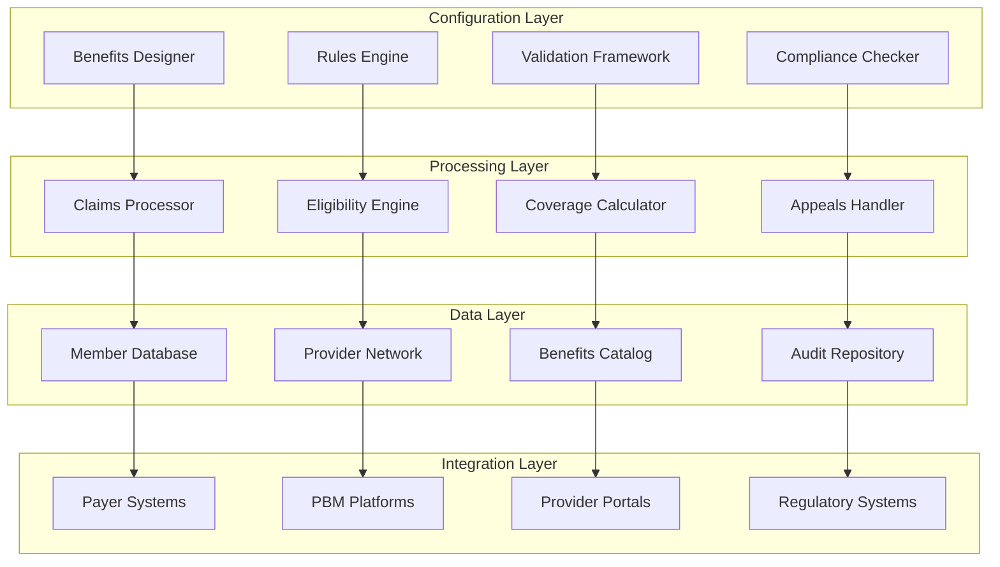

# Benefits Triage - Claims Requirements Configurator

## Overview
The Benefits Triage component provides healthcare benefits configuration with validation logic and regulatory compliance. This specialized healthcare component accelerates benefits administration while ensuring accuracy and compliance with healthcare regulations.

## Core Capabilities

### Benefits Configuration
- Comprehensive benefits plan setup and management
- Claims requirements definition and validation
- Coverage rules and limitations configuration
- Member eligibility and enrollment management

### Validation Logic
- Real-time validation of configuration changes
- Business rules engine for complex scenarios
- Error detection and prevention
- Compliance verification and reporting

### Regulatory Compliance
- HIPAA compliance and security controls
- ACA (Affordable Care Act) requirements
- State-specific regulation adherence
- Audit trail and documentation

## Technical Architecture

## Key Features

### Configurable Rules Engine
- Visual benefits configuration interface
- Complex eligibility rules definition
- Coverage calculation logic
- Exception handling and overrides

### Healthcare Standards Support
- Industry-standard code sets (CPT, ICD-10, HCPCS)
- HIPAA transaction standards
- X12 EDI compliance
- FHIR integration capabilities

### Claims Processing Integration
- Real-time claims validation
- Prior authorization workflows
- Claims routing and processing
- Payment calculation and processing

## Performance Metrics

### Configuration Efficiency
- **Setup Time Reduction**: 60% faster benefits configuration
- **Error Reduction**: 80% fewer configuration errors
- **Processing Speed**: 95% faster claims validation
- **Compliance Rate**: 100% regulatory compliance

### Business Impact
- Accelerated time-to-market for new benefit plans
- Reduced administrative overhead and costs
- Improved member satisfaction and experience
- Enhanced regulatory compliance and audit readiness

## Use Cases

### Healthcare Payer Benefits Management
Configure and manage comprehensive benefit plans for health insurance members.

### Employee Benefits Administration
Set up and manage employer-sponsored health benefit programs.

### PBM Solution Configuration
Configure pharmacy benefit management solutions and formularies.

### Claims Requirements Validation
Validate claims against configured benefit requirements and rules.

## Technology Stack

### Core Technologies
- **Rules Engine**: Drools, IBM ODM, Red Hat Decision Manager
- **Databases**: PostgreSQL, Oracle, SQL Server
- **Integration**: Apache Camel, MuleSoft, WSO2
- **Security**: OAuth 2.0, SAML, encryption standards

### Healthcare Platforms
- Epic, Cerner, Allscripts integration
- Claims processing systems (FACETS, QNXT)
- PBM platforms (SureScripts, NCPDP)
- Regulatory reporting systems

## Implementation Approach

### Analysis Phase (3-4 weeks)
1. Current benefits analysis and gap assessment
2. Regulatory requirement review
3. Stakeholder interviews and requirements gathering
4. Integration architecture design

### Configuration Phase (6-8 weeks)
1. Benefits Triage platform setup
2. Benefits rules and logic configuration
3. Integration with existing systems
4. Validation framework implementation

### Testing Phase (4-6 weeks)
1. Benefits configuration testing
2. Claims processing validation
3. Regulatory compliance verification
4. User acceptance testing

### Deployment Phase (3-4 weeks)
1. Production deployment and go-live
2. User training and support
3. Performance monitoring and optimization
4. Ongoing maintenance and updates

## Success Stories

### Regional Health Plan
**Challenge**: Manual benefits configuration taking 3 months per plan
**Solution**: Automated Benefits Triage implementation with validation
**Results**: 2-week configuration time, 95% error reduction

### Fortune 500 Employer
**Challenge**: Complex multi-state employee benefits compliance
**Solution**: Comprehensive benefits management with regulatory compliance
**Results**: 100% compliance rate, $2M annual cost savings

## Benefits Management Features

### Plan Design
- Comprehensive benefit plan creation
- Coverage tiers and options
- Deductibles and copayment configuration
- Network and provider restrictions

### Member Management
- Eligibility determination and verification
- Enrollment and disenrollment processing
- Dependent coverage management
- COBRA and special enrollment events

### Claims Administration
- Claims adjudication rules
- Prior authorization requirements
- Claims routing and processing
- Appeals and grievance handling

## Regulatory Compliance

### HIPAA Compliance
- Privacy and security rule adherence
- Data encryption and access controls
- Audit logging and monitoring
- Breach notification procedures

### ACA Requirements
- Essential health benefits coverage
- Preventive care requirements
- Mental health parity compliance
- Reporting and documentation

### State Regulations
- State-specific benefit mandates
- Network adequacy requirements
- Premium rate regulations
- Consumer protection rules

## Integration Capabilities

### Payer System Integration
- Core administration system connectivity
- Claims system integration
- Member portal synchronization
- Financial system reconciliation

### Provider Network Integration
- Provider directory management
- Contract and fee schedule integration
- Claims submission and processing
- Prior authorization workflows

## Differentiators

- **Healthcare-Specific**: Built specifically for healthcare benefits management
- **Regulatory Compliance**: Built-in compliance with healthcare regulations
- **Rapid Configuration**: Visual tools for fast benefits setup
- **Validation Framework**: Comprehensive error prevention and detection
- **Integration Ready**: Pre-built connectors for healthcare systems

## Getting Started

Streamline your healthcare benefits administration with our Benefits Triage component. Accelerate benefits configuration while ensuring regulatory compliance and reducing errors.

**Next Steps:**
1. Assess current benefits administration challenges
2. Review regulatory compliance requirements
3. Define benefits configuration and validation needs
4. Plan Benefits Triage implementation strategy