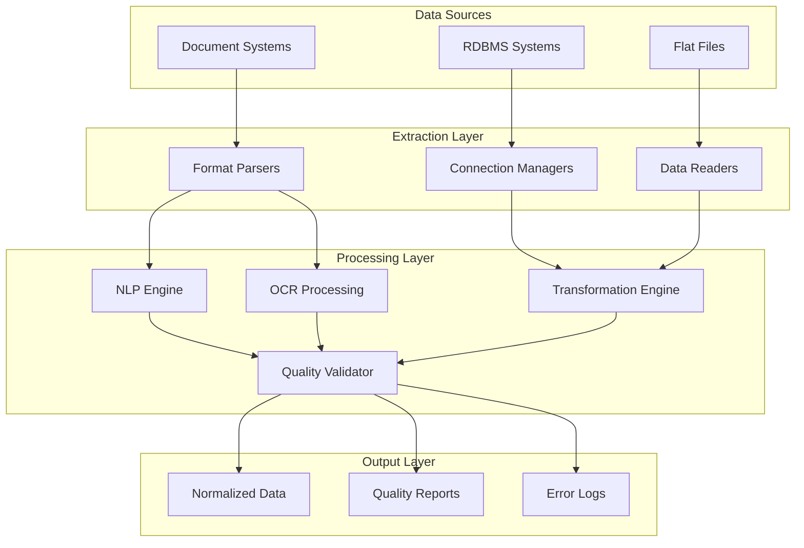

# Data Extractors - RDBMS and Flat File Connectors

## Overview
The Data Extractors component provides automated data extraction capabilities with format normalization and quality validation. This reusable component significantly reduces manual data processing while improving accuracy and standardizing output formats across diverse data sources.

## Core Capabilities

### Automated Data Extraction
- RDBMS connectivity and data extraction
- Flat file processing and parsing
- Multi-format support (CSV, XML, JSON, etc.)
- Batch and real-time extraction modes

### Format Normalization
- Standardized output format generation
- Data type conversion and validation
- Schema mapping and transformation
- Consistent data structure enforcement

### Quality Validation
- Data quality checks and validation rules
- Error detection and reporting
- Data profiling and analysis
- Compliance verification

## Technical Architecture

## Key Features

### NLP Integration
- Contract analysis and key information extraction
- Document processing with intelligent parsing
- Natural language understanding for unstructured data
- Automated content categorization

### OCR Capabilities
- Image-to-text conversion
- Document digitization
- Handwritten text recognition
- Multi-language support

### Data Transformation
- Schema mapping and conversion
- Data cleansing and standardization
- Business rule application
- Custom transformation logic

## Performance Metrics

### Processing Efficiency
- **Manual Processing Reduction**: 60-80% decrease in manual effort
- **Data Accuracy Rate**: 95%+ accuracy in extracted data
- **Processing Speed**: 10x faster than manual extraction
- **Error Rate**: <2% in automated extraction processes

### Business Impact
- Accelerated data migration projects
- Improved data quality and consistency
- Reduced operational costs
- Enhanced compliance and audit readiness

## Use Cases

### Contract Analysis
Extract key terms, dates, and obligations from legal contracts and agreements automatically.

### Legacy Data Migration
Migrate data from legacy systems with automated extraction, validation, and transformation.

### Document Processing
Process invoices, forms, and documents with intelligent data extraction and validation.

### Regulatory Reporting
Extract and prepare data for regulatory submissions with built-in compliance checks.

## Technology Stack

### Core Technologies
- **Languages**: Python, Java, SQL
- **Frameworks**: Apache Spark, Pandas, BeautifulSoup
- **OCR**: Tesseract, Azure Cognitive Services
- **NLP**: spaCy, NLTK, Transformers
- **Databases**: PostgreSQL, MongoDB, Oracle

### Integration Points
- Data lakes and warehouses
- ETL/ELT pipelines
- Business intelligence platforms
- Document management systems

## Implementation Approach

### Assessment Phase (1-2 weeks)
1. Data source inventory and analysis
2. Extraction requirement gathering
3. Quality criteria definition
4. Integration architecture design

### Development Phase (4-8 weeks)
1. Connector development and testing
2. Transformation logic implementation
3. Quality validation setup
4. Performance optimization

### Deployment Phase (2-4 weeks)
1. Production environment setup
2. User training and documentation
3. Monitoring and alerting configuration
4. Go-live support and optimization

## Success Stories

### Fortune 500 Financial Services
**Challenge**: Manual processing of 10,000+ contracts annually
**Solution**: Automated contract analysis with NLP-powered extraction
**Results**: 75% reduction in processing time, 90% accuracy improvement

### Healthcare Organization
**Challenge**: Legacy system data migration across 15 systems
**Solution**: Automated data extraction with quality validation
**Results**: 6-month migration completed in 2 months, zero data loss

## Getting Started

Ready to transform your data extraction processes? Our Data Extractors component can be deployed quickly to start delivering immediate value.

**Next Steps:**
1. Schedule a discovery session
2. Conduct data source assessment  
3. Develop proof of concept
4. Begin implementation