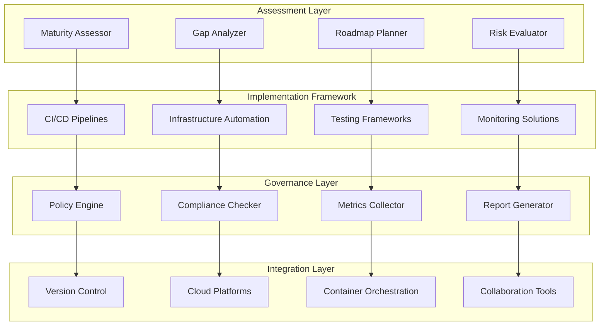

# DevOps Playbook - Implementation Framework

## Overview
The DevOps Playbook provides a structured DevOps adoption framework with maturity assessments and implementation guidance. This component accelerates DevOps transformation through proven methodologies, reducing implementation risks while delivering measurable improvements in development and operational efficiency.

## Core Capabilities

### DevOps Maturity Assessment
- Comprehensive current state analysis
- Capability gap identification
- Maturity scoring and benchmarking
- Roadmap development and prioritization

### Implementation Framework
- Structured transformation methodology
- Phase-based implementation approach
- Risk mitigation strategies
- Change management best practices

### Automation Practices
- CI/CD pipeline design and implementation
- Infrastructure as Code (IaC) frameworks
- Automated testing and quality gates
- Monitoring and observability setup

## Technical Architecture

## Key Features

### CI/CD Pipeline Templates
- Multi-language build configurations
- Automated testing integration
- Deployment automation
- Release management workflows

### Infrastructure as Code
- Terraform and CloudFormation templates
- Kubernetes deployment manifests
- Configuration management automation
- Environment provisioning scripts

### Quality Gates and Testing
- Automated unit and integration testing
- Security scanning integration
- Performance testing frameworks
- Code quality analysis

## Performance Metrics

### DevOps Maturity Improvements
- **Deployment Frequency**: 10x increase in deployment frequency
- **Lead Time**: 75% reduction in code-to-production time
- **Mean Time to Recovery**: 80% faster incident resolution
- **Change Failure Rate**: 50% reduction in failed deployments

### Business Impact
- Accelerated time-to-market for new features
- Improved software quality and reliability
- Enhanced team collaboration and productivity
- Reduced operational costs and overhead

## Use Cases

### Enterprise DevOps Transformation
Transform traditional IT organizations to modern DevOps practices and culture.

### Cloud Migration Acceleration
Enable DevOps practices during cloud migration and modernization initiatives.

### Development Team Scaling
Scale development teams while maintaining quality and delivery speed.

### Legacy System Modernization
Apply DevOps practices to legacy application modernization projects.

## Technology Stack

### CI/CD Technologies
- **Orchestration**: Jenkins, GitHub Actions, Azure DevOps, GitLab CI
- **Containerization**: Docker, Podman, containerd
- **Orchestration**: Kubernetes, OpenShift, Docker Swarm
- **Monitoring**: Prometheus, Grafana, ELK Stack, Datadog

### Infrastructure Automation
- **IaC Tools**: Terraform, AWS CloudFormation, Azure ARM
- **Configuration**: Ansible, Chef, Puppet, SaltStack
- **Cloud Platforms**: AWS, Azure, Google Cloud, hybrid environments
- **Networking**: Software-defined networking, service mesh

## Implementation Approach

### Assessment Phase (3-4 weeks)
1. Current state DevOps maturity assessment
2. Organizational readiness evaluation
3. Technology landscape analysis
4. Transformation roadmap development

### Foundation Phase (6-8 weeks)
1. Core infrastructure and tooling setup
2. CI/CD pipeline implementation
3. Automation framework development
4. Security and compliance integration

### Transformation Phase (12-16 weeks)
1. Team onboarding and training
2. Process standardization and optimization
3. Advanced automation implementation
4. Culture and collaboration improvements

### Optimization Phase (Ongoing)
1. Continuous improvement processes
2. Advanced DevOps practices adoption
3. Metrics-driven optimization
4. Innovation and experimentation

## Success Stories

### Fortune 500 Financial Services
**Challenge**: 6-month release cycles with high failure rates
**Solution**: Comprehensive DevOps transformation with automated pipelines
**Results**: Weekly releases, 90% reduction in deployment failures

### Global Technology Company
**Challenge**: 50+ development teams with inconsistent practices
**Solution**: Standardized DevOps playbook and platform implementation
**Results**: 5x faster feature delivery, 60% improvement in quality

## DevOps Practices

### Continuous Integration
- Automated build and test processes
- Code quality gates and analysis
- Branching strategies and workflows
- Integration testing automation

### Continuous Deployment
- Automated deployment pipelines
- Environment management and promotion
- Blue-green and canary deployments
- Rollback and recovery procedures

### Continuous Monitoring
- Application and infrastructure monitoring
- Log aggregation and analysis
- Performance metrics and alerting
- Business metrics tracking

## Cultural Transformation

### Team Collaboration
- Cross-functional team formation
- Shared responsibility models
- Communication and feedback loops
- Knowledge sharing practices

### Learning and Improvement
- Continuous learning culture
- Experimentation and innovation
- Failure analysis and learning
- Skill development programs

### Customer Focus
- Customer feedback integration
- Value stream optimization
- Feature flag and experimentation
- User experience monitoring

## Maturity Assessment Framework

### Culture and Collaboration
- Team structure and communication
- Shared goals and responsibilities
- Learning and experimentation mindset
- Customer-centric approach

### Process and Practices
- Development and deployment processes
- Testing and quality assurance
- Incident response and recovery
- Change management procedures

### Technology and Automation
- Tool integration and automation
- Infrastructure and platform management
- Monitoring and observability
- Security and compliance automation

## Risk Mitigation Strategies

### Technical Risks
- Gradual implementation approach
- Pilot programs and proof of concepts
- Rollback and recovery procedures
- Comprehensive testing strategies

### Organizational Risks
- Change management and communication
- Training and skill development
- Leadership support and sponsorship
- Cultural transformation planning

### Operational Risks
- Monitoring and alerting implementation
- Incident response procedures
- Business continuity planning
- Security and compliance measures

## Success Metrics

### Speed and Agility
- Deployment frequency and lead time
- Development cycle time
- Feature delivery speed
- Innovation cycle time

### Quality and Reliability
- Defect rates and severity
- System availability and performance
- Customer satisfaction scores
- Security incident frequency

### Efficiency and Cost
- Resource utilization optimization
- Operational cost reduction
- Team productivity improvement
- Waste elimination

## Differentiators

- **Proven Methodology**: Battle-tested implementation framework
- **Risk Mitigation**: Comprehensive risk assessment and mitigation strategies
- **Measurable Results**: Objective metrics and continuous improvement
- **Cultural Focus**: Emphasis on people and culture transformation
- **Technology Agnostic**: Flexible approach supporting various technology stacks

## Getting Started

Accelerate your DevOps transformation with our comprehensive DevOps Playbook. Reduce implementation risks while achieving measurable improvements in speed, quality, and efficiency.

**Next Steps:**
1. Conduct DevOps maturity assessment
2. Define transformation goals and success criteria
3. Develop customized implementation roadmap
4. Begin structured DevOps transformation journey