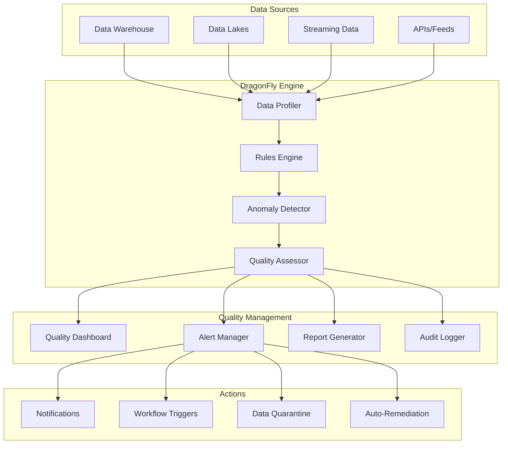

# DragonFly - Data Quality Assessment

## Overview
DragonFly provides real-time data quality monitoring with automated validation and proactive issue identification. This component ensures enterprise data reliability and compliance through continuous quality monitoring and intelligent alerting systems.

## Core Capabilities

### Real-time Monitoring
- Continuous data quality assessment
- Live quality metrics and dashboards
- Automated anomaly detection
- Proactive alert generation

### Automated Validation
- Configurable business rules engine
- Data profiling and statistical analysis
- Completeness and accuracy checks
- Referential integrity validation

### Quality Reporting
- Comprehensive quality scorecards
- Trend analysis and historical tracking
- Root cause analysis and recommendations
- Compliance and audit reporting

## Technical Architecture

## Key Features

### Data Validation Engine
- Comprehensive validation rule library
- Custom rule development and deployment
- Statistical validation and outlier detection
- Cross-dataset validation and reconciliation

### Business Rules Framework
- Business-friendly rule definition interface
- Complex validation logic support
- Rule versioning and change management
- Impact analysis for rule changes

### Intelligent Alerting
- Smart threshold-based alerting
- Machine learning-powered anomaly detection
- Configurable notification channels
- Alert prioritization and escalation

## Performance Metrics

### Quality Detection
- **Issue Identification Rate**: 95%+ accuracy in quality issue detection
- **False Positive Rate**: <5% false alerts
- **Response Time**: <5 minutes from issue occurrence to alert
- **Coverage**: 100% of critical data elements monitored

### Business Impact
- 80% reduction in data quality incidents
- 60% faster issue resolution time
- 90% improvement in compliance audit results
- $2M+ annual cost savings from prevented errors

## Use Cases

### Data Warehouse Quality Assurance
Ensure high-quality data in enterprise data warehouses with comprehensive validation.

### Regulatory Compliance Monitoring
Meet regulatory requirements with continuous compliance monitoring and reporting.

### ETL Pipeline Validation
Validate data quality at every stage of ETL/ELT processing pipelines.

### Real-time Data Streams
Monitor streaming data quality in real-time with immediate issue detection.

## Technology Stack

### Core Technologies
- **Processing**: Apache Spark, Python, Scala
- **Rules Engine**: Drools, Python-based custom engine
- **Monitoring**: Prometheus, Grafana, ELK Stack
- **Databases**: PostgreSQL, MongoDB, InfluxDB
- **ML Libraries**: scikit-learn, TensorFlow

### Integration Points
- Data warehouses (Snowflake, Redshift, BigQuery)
- ETL tools (Apache Airflow, Talend, Informatica)
- BI platforms (Tableau, Power BI, Looker)
- Workflow systems (Apache Airflow, Prefect)

## Implementation Approach

### Assessment Phase (2-3 weeks)
1. Data quality current state analysis
2. Critical data element identification
3. Quality requirements and SLA definition
4. Integration architecture planning

### Configuration Phase (4-6 weeks)
1. DragonFly platform setup and configuration
2. Data source connections and profiling
3. Business rules development and testing
4. Dashboard and reporting setup

### Deployment Phase (3-4 weeks)
1. Production deployment and validation
2. User training and enablement
3. Monitoring and alerting fine-tuning
4. Process integration and workflow setup

## Success Stories

### Fortune 100 Retailer
**Challenge**: Data quality issues causing $5M annual revenue impact
**Solution**: Comprehensive DragonFly implementation across data ecosystem
**Results**: 95% reduction in quality incidents, $4.5M annual savings

### Healthcare Payer
**Challenge**: Regulatory compliance risks due to data quality issues
**Solution**: Real-time quality monitoring for claims and member data
**Results**: Zero compliance violations, 100% audit success rate

## Quality Dimensions

### Completeness
- Missing value detection and reporting
- Required field validation
- Data coverage analysis
- Gap identification and trending

### Accuracy
- Business rule validation
- Reference data verification
- Format and pattern checking
- Cross-system consistency validation

### Timeliness
- Data freshness monitoring
- SLA compliance tracking
- Latency analysis and alerting
- Temporal consistency validation

### Consistency
- Cross-system data reconciliation
- Referential integrity validation
- Format standardization checking
- Business logic consistency

## Differentiators

- **Real-time Processing**: Immediate quality assessment and alerting
- **AI-Powered**: Machine learning for intelligent anomaly detection
- **Business-Friendly**: Non-technical users can define quality rules
- **Comprehensive Coverage**: Monitors all dimensions of data quality
- **Proactive Approach**: Prevents issues before they impact business

## Getting Started

Ensure your data quality with DragonFly's comprehensive monitoring and validation capabilities. Protect your business from data quality risks and maintain regulatory compliance.

**Next Steps:**
1. Conduct data quality assessment
2. Define quality requirements and SLAs
3. Deploy DragonFly pilot implementation
4. Scale to enterprise-wide deployment