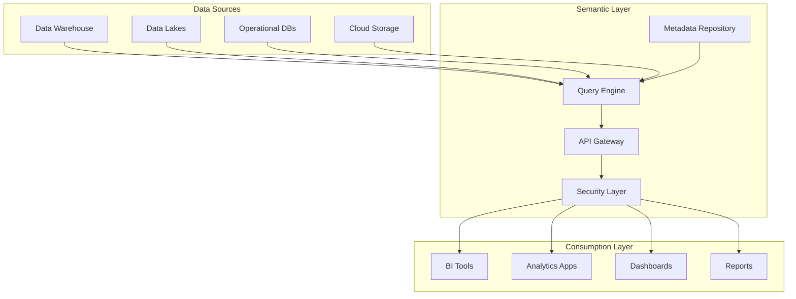

# Semantic Layer - Unified Data Access APIs

## Overview
The Semantic Layer component provides a business-friendly data access layer with consistent metrics and unified APIs. This component enables organizations to democratize data access while maintaining data governance and ensuring consistent definitions across the enterprise.

## Core Capabilities

### Unified Data Access
- Single point of access for all enterprise data
- Business-friendly query interfaces
- Consistent metric definitions and calculations
- Self-service analytics enablement

### API Management
- RESTful API generation and management
- GraphQL support for flexible querying
- Authentication and authorization controls
- Rate limiting and performance optimization

### Data Virtualization
- Real-time data federation across sources
- Cache management for performance
- Query optimization and routing
- Data lineage and impact analysis

## Technical Architecture

## Key Features

### AtScale/Dremio Integration
- Seamless integration with leading data virtualization platforms
- Optimized query performance and caching
- Multi-source federation capabilities
- Enterprise-grade scalability

### Metadata Management
- Comprehensive business glossary
- Data lineage tracking
- Impact analysis and change management
- Automated documentation generation

### Security and Governance
- Role-based access controls
- Column and row-level security
- Audit logging and compliance
- Data masking and anonymization

## Performance Metrics

### Access Efficiency
- **Query Performance**: 50% faster data access
- **API Response Time**: <500ms average response
- **Cache Hit Ratio**: 80%+ cache effectiveness
- **Concurrent Users**: Support for 1000+ simultaneous users

### Business Impact
- 90% metric standardization across reports
- 60% reduction in report development time
- Self-service adoption by 75% of business users
- Elimination of metric discrepancies

## Use Cases

### Enterprise Business Intelligence
Standardize metrics and enable self-service analytics across the organization.

### Data Democratization
Empower business users with direct, governed access to enterprise data.

### Cross-Functional Reporting
Ensure consistent definitions and calculations across departments and functions.

### Real-time Analytics
Enable real-time decision making with fast, reliable data access.

## Technology Stack

### Core Technologies
- **Virtualization**: AtScale, Dremio, Denodo
- **APIs**: REST, GraphQL, OData
- **Databases**: Apache Spark, Presto, Trino
- **Security**: OAuth 2.0, SAML, JWT
- **Monitoring**: Prometheus, Grafana

### Integration Platforms
- Tableau, Power BI, Qlik
- Snowflake, Databricks, BigQuery
- Kubernetes, Docker
- Apache Kafka, Apache Airflow

## Implementation Approach

### Discovery Phase (2-3 weeks)
1. Data landscape assessment
2. Business requirements gathering
3. Metric inventory and standardization
4. Architecture design and planning

### Development Phase (6-10 weeks)
1. Semantic layer setup and configuration
2. Data source connections and mapping
3. API development and testing
4. Security implementation

### Rollout Phase (4-6 weeks)
1. User training and enablement
2. Dashboard and report migration
3. Performance monitoring setup
4. Support and optimization

## Success Stories

### Global Manufacturing Company
**Challenge**: Inconsistent metrics across 50+ reports and dashboards
**Solution**: Unified semantic layer with standardized business definitions
**Results**: 100% metric consistency, 50% reduction in reporting errors

### Financial Services Firm
**Challenge**: Complex data access requiring IT for every business request
**Solution**: Self-service semantic layer with governed data access
**Results**: 80% of requests handled without IT, 3x faster insight delivery

## Differentiators

- **Business-Centric Design**: Focuses on business user needs, not technical complexity
- **Performance Optimized**: Advanced caching and query optimization
- **Governance Built-in**: Security and compliance from the ground up
- **Platform Agnostic**: Works with any data platform or BI tool
- **Real-time Capable**: Supports both batch and streaming data sources

## Getting Started

Transform your data access strategy with our Semantic Layer component. Enable self-service analytics while maintaining enterprise governance and security.

**Next Steps:**
1. Schedule a data architecture review
2. Identify key use cases and metrics
3. Develop semantic layer prototype
4. Plan enterprise rollout strategy