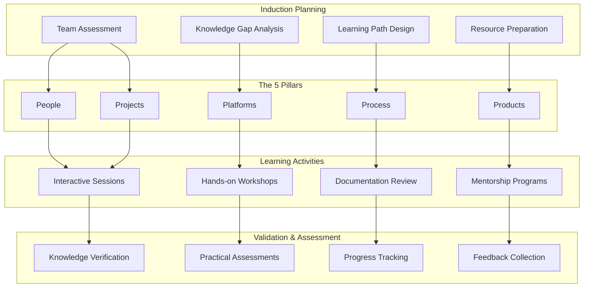

# 5P Induction Process

## Overview
The 5P Induction Process is a comprehensive onboarding framework covering People, Platforms, Process, Products, and Projects. This structured approach accelerates team productivity and reduces knowledge gaps through systematic knowledge transfer and team integration.

## The Five Pillars

### 1. People
Understanding team structure, roles, culture, and relationships
- Organizational structure and hierarchy
- Team roles and responsibilities  
- Company culture and values
- Communication styles and preferences
- Key stakeholders and decision makers

### 2. Platforms
Technology stack, tools, and infrastructure knowledge
- Development platforms and environments
- Tools and software applications
- Infrastructure and deployment systems
- Security protocols and access controls
- Monitoring and observability tools

### 3. Process
Workflows, methodologies, and operational procedures
- Development and delivery methodologies
- Quality assurance and testing processes
- Change management and deployment procedures
- Documentation and knowledge management
- Compliance and governance requirements

### 4. Products
Domain knowledge, specifications, and business context
- Product features and functionality
- Business requirements and specifications
- User personas and customer needs
- Market position and competitive landscape
- Product roadmap and strategic direction

### 5. Projects
Current initiatives, objectives, and deliverables
- Active project portfolio and priorities
- Project goals and success criteria
- Timeline and milestone commitments
- Resource allocation and dependencies
- Risk factors and mitigation strategies

## Framework Architecture

## Implementation Framework

### Week 1: People & Culture
- Organization structure and team introductions
- Culture and values orientation
- Communication protocols and tools
- Stakeholder mapping and relationship building
- Social integration activities

### Week 2: Platforms & Technology
- Technology stack overview and training
- Development environment setup
- Tool access and configuration
- Security and compliance orientation
- Hands-on platform exercises

### Week 3: Process & Methodology  
- Development methodology training
- Quality assurance procedures
- Change management processes
- Documentation standards and practices
- Workflow and approval procedures

### Week 4: Products & Domain
- Product portfolio overview
- Business domain knowledge transfer
- Customer and market understanding
- Requirements and specifications review
- Product roadmap and strategy

### Week 5: Projects & Execution
- Current project portfolio review
- Active initiative deep dives
- Role assignment and responsibilities
- Timeline and milestone alignment
- Initial project contributions

## Key Components

### Comprehensive Induction Guides
- Structured learning materials for each pillar
- Interactive checklists and progress tracking
- Reference documentation and resources
- Best practices and lessons learned
- FAQs and troubleshooting guides

### Learning Pathways
- Role-specific learning tracks
- Progressive skill development paths
- Competency-based progression
- Flexible pacing and scheduling
- Multi-modal learning approaches

### Knowledge Verification
- Assessments for each pillar
- Practical application exercises
- Knowledge retention testing
- Competency validation
- Certification and recognition

### Mentorship Framework
- Experienced team member pairing
- Regular guidance and support sessions
- Progress monitoring and feedback
- Career development discussions
- Long-term relationship building

## Target Scenarios

### New Team Formation
- Rapid team assembly and onboarding
- Cross-functional team creation
- Distributed team integration
- Diverse skill set integration
- Cultural alignment and cohesion

### Project Transitions
- Knowledge handover between teams
- Role transition and succession
- Project inheritance and continuity
- Context preservation and transfer
- Reduced transition risks

### Knowledge Preservation
- Critical knowledge documentation
- Expertise transfer and retention
- Institutional knowledge capture
- Best practices consolidation
- Organizational learning enhancement

## Success Metrics

### Productivity Acceleration
- **Time to Productivity**: 50% faster team effectiveness
- **Knowledge Retention**: 85% successful knowledge transfer
- **Error Reduction**: 40% fewer onboarding-related mistakes
- **Satisfaction**: 90% participant satisfaction rating

### Business Impact
- Reduced project risks and delays
- Improved team collaboration and communication
- Enhanced knowledge sharing and retention
- Faster project execution and delivery
- Higher quality outcomes and deliverables

## Benefits

### For New Team Members
- Structured and comprehensive onboarding experience
- Clear understanding of role and expectations
- Rapid integration into team and organization
- Access to mentorship and guidance
- Confidence and competence building

### For Organizations
- Standardized onboarding process and quality
- Reduced knowledge gaps and risks
- Improved team productivity and performance
- Enhanced knowledge retention and transfer
- Stronger team cohesion and culture

### For Projects
- Faster project initiation and execution
- Reduced ramp-up time and delays
- Improved quality and consistency
- Better stakeholder communication
- Higher success probability

## Implementation Support

### Training Materials
- Comprehensive guides and documentation
- Interactive presentations and workshops
- Video tutorials and demonstrations
- Templates and checklists
- Assessment tools and resources

### Facilitation Services
- Expert-led induction sessions
- Customized training delivery
- Progress monitoring and support
- Feedback collection and analysis
- Continuous improvement recommendations

### Technology Platform
- Learning management system
- Progress tracking and reporting
- Resource library and repository
- Communication and collaboration tools
- Assessment and certification platform

## Getting Started

Transform your team onboarding with the 5P Induction Process. Accelerate productivity while ensuring comprehensive knowledge transfer and team integration.

**Next Steps:**
1. Assess current onboarding processes and gaps
2. Customize 5P framework for your organization
3. Prepare induction materials and resources
4. Train facilitators and mentors
5. Launch pilot induction program