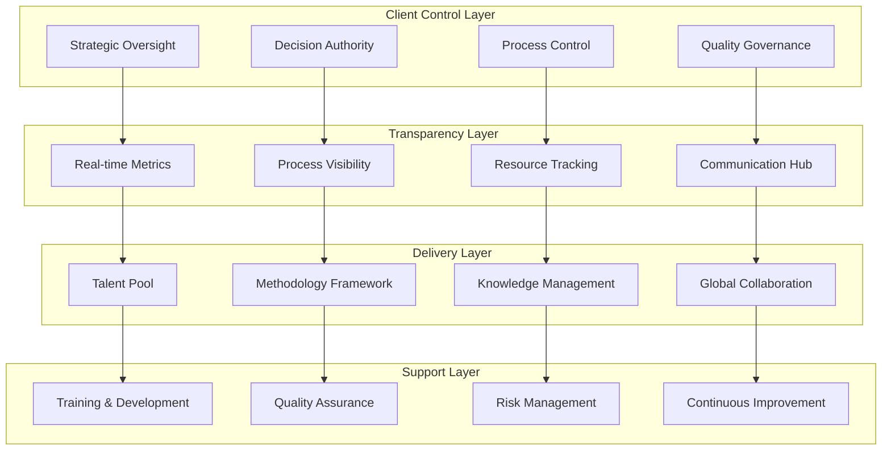

# EDC Model - Extended Delivery Center Framework

## Overview
The Extended Delivery Center (EDC) Model is a white-box engagement framework that provides complete transparency and control for large-scale strategic partnerships. This comprehensive delivery framework enables clients to maintain full visibility and control over all delivery processes while leveraging external expertise and resources.

## Strategic Value

### Complete Transparency
- Full visibility into all delivery processes and methodologies
- Real-time access to project metrics and performance indicators
- Transparent reporting across all levels of engagement
- Open communication channels and regular stakeholder updates

### Enhanced Control
- Client maintains 100% control over delivery decisions
- Direct involvement in team selection and management
- Influence over methodology and process customization
- Authority over project priorities and resource allocation

### Risk Mitigation
- Reduced outsourcing risks through transparency
- Enhanced knowledge retention within client organization
- Minimized vendor lock-in through open methodologies
- Proactive issue identification and resolution

## Framework Architecture

## Key Features

### Customized Methodology
- Tailored delivery approaches for specific client needs
- Flexible process adaptation based on organizational requirements
- Industry-specific best practices integration
- Continuous methodology refinement and optimization

### Talent Creation & Retention
- Comprehensive resource development programs
- Skill enhancement and certification pathways
- Knowledge transfer and mentorship programs
- Career development and retention strategies

### Seamless Global Collaboration
- Integrated teams across multiple geographical locations
- 24/7 delivery capabilities with follow-the-sun model
- Cultural integration and communication protocols
- Standardized collaboration tools and processes

## Investment and Returns

### CY25 Investment Projection
- **Initial Investment**: $150,000
- **Implementation Timeline**: 6-8 months
- **Resource Allocation**: Framework development, training, and setup

### Projected Returns
- **Financial Returns**: $2M+ over 3 years
- **Operational Efficiency**: 30% improvement in delivery predictability
- **Knowledge Retention**: 50% enhancement in knowledge preservation
- **Risk Reduction**: 40% decrease in delivery-related risks

### ROI Breakdown
- Operational efficiency improvements
- Enhanced delivery quality and speed
- Reduced rework and quality issues
- Improved client satisfaction and retention

## Target Scenarios

### Large-Scale Engagements
- Multi-year strategic partnerships
- Enterprise-wide transformation initiatives
- Complex technology implementations
- Mission-critical system development

### Strategic Partnerships
- Long-term collaborative relationships
- Shared investment in capabilities and resources
- Joint innovation and development programs
- Strategic business alignment initiatives

### Complex Transformations
- Digital transformation programs
- Legacy system modernization
- Business process reengineering
- Organizational change initiatives

## Implementation Approach

### Phase 1: Foundation Setup (8-12 weeks)
1. Framework customization and configuration
2. Governance structure establishment
3. Communication protocols definition
4. Initial team formation and training

### Phase 2: Process Integration (6-8 weeks)
1. Methodology alignment and customization
2. Quality frameworks implementation
3. Metrics and reporting setup
4. Risk management procedures establishment

### Phase 3: Delivery Optimization (4-6 weeks)
1. Process refinement and optimization
2. Performance monitoring and tuning
3. Continuous improvement implementation
4. Knowledge transfer and documentation

### Phase 4: Scale and Expand (Ongoing)
1. Capability expansion and enhancement
2. Additional service line integration
3. Advanced automation implementation
4. Innovation and R&D initiatives

## Success Metrics

### Delivery Performance
- **On-time Delivery**: 95%+ project completion within timeline
- **Quality Standards**: 98%+ deliverables meeting quality criteria
- **Budget Adherence**: 90%+ projects delivered within budget
- **Client Satisfaction**: 9/10 average satisfaction rating

### Process Excellence
- **Methodology Adoption**: 100% standardized process compliance
- **Knowledge Retention**: 80%+ knowledge successfully transferred
- **Risk Mitigation**: 50% reduction in project risks
- **Innovation Impact**: 25% improvement in solution innovation

## Competitive Differentiation

### White-Box Delivery
- Complete transparency differentiating from traditional outsourcing
- Full client control and decision-making authority
- Open methodologies and process visibility
- Collaborative partnership approach

### Measurable Outcomes
- Objective metrics demonstrating value delivery
- Real-time performance monitoring and reporting
- Data-driven decision making and optimization
- Continuous improvement based on measurable results

### Scalable Processes
- Frameworks that grow with client engagement complexity
- Flexible resource scaling and capability expansion
- Adaptable methodologies for diverse requirements
- Global delivery model with local expertise

## Framework Components

### Governance Framework
- Strategic oversight and decision-making processes
- Quality assurance and compliance procedures
- Risk management and mitigation strategies
- Performance monitoring and reporting systems

### Delivery Methodology
- Customized development and delivery processes
- Quality gates and approval mechanisms
- Testing and validation procedures
- Deployment and support frameworks

### Knowledge Management
- Documentation standards and repositories
- Knowledge transfer procedures and protocols
- Training and certification programs
- Best practices capture and sharing

### Communication Framework
- Regular reporting and status updates
- Stakeholder engagement and feedback loops
- Issue escalation and resolution procedures
- Collaborative tools and platforms

## Industry Recognition

### Proven Methodologies
- Demonstrated client success across industries
- Industry best practices integration
- Continuous improvement based on client feedback
- Recognition for delivery excellence and innovation

### Client Testimonials
- Consistent positive feedback on transparency
- High ratings for delivery quality and timeliness
- Recognition for partnership approach
- Endorsements for value delivery and outcomes

## Getting Started

Transform your strategic partnerships with the EDC Model. Gain complete transparency and control while leveraging world-class delivery capabilities and expertise.

**Next Steps:**
1. Assess current engagement model and requirements
2. Define transparency and control objectives
3. Customize EDC framework for your organization
4. Plan implementation roadmap and timeline