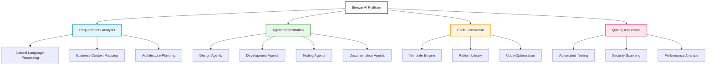

# Breeze.AI - AI-Driven SDLC Transformation

## Overview

Breeze.AI is Accion's innovative AI-powered software development lifecycle transformation platform. With a strategic investment of $200K in CY25, this developing platform targets projected returns of $500K, representing a 2.5:1 ROI as we build the future of AI-driven development.

## Key Features

### Architecture as Code
Automated architecture generation from business requirements, transforming natural language specifications into technical architecture blueprints and implementation plans.

**Business Value**: Reduced manual architecture design effort and improved consistency, enabling faster project initiation and better alignment between business needs and technical solutions.

### Specialized Agent Suite
AI agents designed for different SDLC phases including:
- **Design Agents**: Requirements analysis and system design
- **Development Agents**: Code generation and optimization
- **Testing Agents**: Automated test creation and execution
- **Documentation Agents**: Technical and user documentation generation

**Business Value**: Automated SDLC processes with consistent quality and reduced human error, leading to more predictable delivery timelines and outcomes.

### Automated Validation
Quality assurance through AI-powered testing and validation, including code review, performance analysis, and security scanning integrated into the development workflow.

**Business Value**: Enhanced code quality and reduced defect rates, minimizing post-deployment issues and maintenance costs.

### Enterprise Semantic Model
Business context understanding system that enables AI to generate code that aligns with enterprise standards, naming conventions, and architectural patterns.

**Business Value**: AI-generated code that aligns with business requirements and standards, reducing the gap between generated code and production-ready solutions.

## Business Impact Metrics

| Metric | Value | Impact |
|--------|-------|--------|
| **Development Speed** | 35% faster | time-to-market acceleration |
| **Quality Improvement** | 47% fewer | defects in delivered code |
| **Communication Enhancement** | 44% less | translation loss between teams |
| **Technical Debt Reduction** | 58% less | technical debt accumulation |

## Technology Stack

- **AI Agents**: Specialized artificial intelligence for development tasks
- **Semantic Models**: Business context understanding and representation
- **Orchestration**: Workflow automation and coordination
- **Machine Learning**: Continuous improvement and learning capabilities
- **Natural Language Processing**: Requirements understanding and code generation

## Innovation Focus

### Code Generation
Architecture-to-code automation that transforms high-level designs into working code, reducing manual development effort and improving consistency across projects.

### Best Practice Integration
Industry standards and best practices built into the AI models, ensuring generated code follows established patterns and guidelines.

### Continuous Learning
AI models that improve over time based on feedback and outcomes, creating a platform that becomes more effective with usage.

### Enterprise Integration
Seamless workflow integration with existing development tools and processes, minimizing disruption while maximizing value.

## Target Industries

- **Technology**: SaaS development, platform engineering, API development
- **Financial Services**: Fintech applications, regulatory compliance systems, trading platforms

## Platform Architecture

## Implementation Benefits

### For Development Teams
- Accelerated development cycles with AI assistance
- Reduced repetitive coding tasks
- Built-in quality assurance and best practices
- Enhanced focus on creative problem-solving

### For Project Managers
- More predictable delivery timelines
- Improved resource utilization
- Better project visibility and control
- Reduced project risks

### For Organizations
- Faster time-to-market for applications
- Improved code quality and maintainability
- Reduced development costs
- Enhanced competitive advantage through AI adoption

## Investment and Returns

- **CY25 Investment**: $200K (24% of total platform investment)
- **Projected Returns**: $500K
- **ROI Ratio**: 2.5:1
- **Strategic Focus**: Building the foundation for AI-driven development excellence

## Development Roadmap

### Phase 1: Foundation (Current)
- Core AI agent development
- Basic code generation capabilities
- Enterprise semantic model development
- Initial integration frameworks

### Phase 2: Enhancement
- Advanced pattern recognition
- Multi-language code generation
- Sophisticated testing automation
- Performance optimization features

### Phase 3: Intelligence
- Self-improving AI models
- Advanced business context understanding
- Predictive development analytics
- Autonomous development workflows

## Competitive Advantage

Breeze.AI positions Accion at the forefront of AI-driven development transformation. By combining our deep expertise in enterprise architecture (BREEZE) with cutting-edge AI capabilities, we're creating a unique platform that bridges the gap between business requirements and technical implementation.

## Future Vision

As AI technology continues to evolve, Breeze.AI represents our commitment to staying ahead of the curve in development automation. The platform's learning capabilities ensure that it will become increasingly valuable over time, creating a sustainable competitive advantage and significant long-term value for both Accion and our clients.