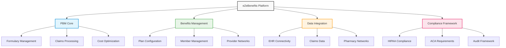

# eZeBenefits - Healthcare Innovation Blueprint

## Overview

eZeBenefits is Accion's comprehensive healthcare benefits and PBM (Pharmacy Benefit Management) solution platform that has established a strong presence in the healthcare market. With a modest investment of $50K in CY25, this mature platform has generated $4.2M in revenue for CY24 and projects $3.1M for CY25, delivering an exceptional ROI while serving major healthcare organizations.

## Key Features

### PBM Solutions
Comprehensive pharmacy benefit management capabilities that handle prescription drug benefits, formulary management, claims processing, and cost optimization.

**Business Value**: Streamlined pharmacy benefits administration and cost optimization, enabling healthcare organizations to better manage prescription drug costs and improve patient outcomes.

### Healthcare Data Integration
Comprehensive data connectivity platform that integrates with various healthcare systems, including EHRs, claims systems, and pharmacy networks.

**Business Value**: Unified view of healthcare data for better decision-making, enabling more informed clinical and administrative decisions while reducing data silos.

### Benefits Configuration
Flexible benefit plan setup and management system that allows healthcare organizations to configure and customize benefit plans according to specific requirements.

**Business Value**: Customizable benefits administration reducing operational complexity, enabling organizations to offer tailored benefits while simplifying management processes.

### Regulatory Compliance
Built-in adherence to healthcare industry standards including HIPAA, ACA, and other regulatory requirements that automatically maintain compliance.

**Business Value**: Automated compliance management reducing risk and administrative burden, ensuring organizations meet regulatory requirements without manual oversight.

## Business Impact Metrics

| Metric | Value | Impact |
|--------|-------|--------|
| **Revenue Generation** | $4.2M | revenue in CY24 |
| **Market Presence** | Major implementations | at CVS, Navitus, BlueCross |
| **Growth Trajectory** | $3.1M projected | revenue for CY25 |
| **Market Position** | Established presence | in healthcare benefits market |

## Technology Stack

- **Healthcare Standards**: HL7, FHIR, X12 EDI compliance
- **Cloud Platforms**: Scalable cloud infrastructure for healthcare workloads
- **Database Management**: Secure, HIPAA-compliant data storage and management
- **Integration APIs**: Comprehensive connectivity for healthcare ecosystems
- **Security Frameworks**: Healthcare-grade security and privacy protection

## Strategic Market Position

### Healthcare Expertise
Deep domain knowledge and proven solutions developed through years of healthcare industry experience and client implementations.

### Established Client Base
Major healthcare organizations including CVS, Navitus, and BlueCross have successfully implemented eZeBenefits solutions, demonstrating market validation.

### Licensing Opportunity
Platform components that can be licensed to broader market participants, creating scalable revenue opportunities beyond direct implementations.

### Regulatory Advantage
Built-in compliance and standards adherence that provides competitive advantage in the highly regulated healthcare market.

## Target Market

- **Healthcare Payers**: Insurance companies and managed care organizations
- **Pharmacy Benefit Managers**: PBM companies and pharmacy chains
- **Healthcare Providers**: Hospital systems and integrated delivery networks
- **Employers**: Large employers offering healthcare benefits to employees

## Platform Architecture

## Client Success Stories

### CVS Implementation
Successful deployment of PBM solutions that improved prescription processing efficiency and enhanced member experience.

### Navitus Partnership
Integration of benefits management capabilities that streamlined operations and reduced administrative costs.

### BlueCross Integration
Implementation of comprehensive healthcare data integration that improved clinical decision-making and member outcomes.

## Revenue Model

### Direct Implementation
Custom implementations for major healthcare organizations with comprehensive support and maintenance services.

### Platform Licensing
Licensing of platform components to other healthcare technology providers and consultants.

### Subscription Services
Ongoing subscription services for hosted solutions and managed services offerings.

### Professional Services
Consulting and implementation services leveraging deep healthcare domain expertise.

## Investment and Returns

- **CY25 Investment**: $50K (6% of total platform investment)
- **CY24 Revenue**: $4.2M
- **CY25 Projected Revenue**: $3.1M
- **ROI Ratio**: 84:1 (based on CY24 performance)
- **Market Position**: Established presence with major client relationships

## Competitive Advantages

### Domain Expertise
Deep understanding of healthcare benefits management and regulatory requirements that competitors often lack.

### Proven Track Record
Successful implementations at major healthcare organizations demonstrate platform reliability and effectiveness.

### Regulatory Compliance
Built-in compliance features that reduce implementation risk and ongoing compliance burden for clients.

### Scalable Architecture
Platform design that can scale from small implementations to enterprise-wide deployments.

## Future Growth Opportunities

### AI-Powered Analytics
Integration of artificial intelligence for predictive healthcare analytics and personalized benefit recommendations.

### Value-Based Care
Enhanced capabilities for value-based care models and outcome-based benefit management.

### Consumer Engagement
Mobile and digital engagement platforms for improved member experience and self-service capabilities.

### Interoperability Enhancement
Advanced interoperability features for seamless integration with emerging healthcare standards and technologies.

## Market Outlook

The healthcare benefits market continues to grow driven by regulatory changes, technology adoption, and focus on cost containment. eZeBenefits is well-positioned to capitalize on these trends with proven solutions and established client relationships.

### Market Drivers
- Healthcare cost containment initiatives
- Regulatory compliance requirements
- Digital transformation in healthcare
- Value-based care adoption

### Growth Strategy
- Expand existing client relationships
- Develop new market segments
- Enhance platform capabilities
- Explore strategic partnerships

## Conclusion

eZeBenefits represents a significant success story in healthcare technology, delivering substantial revenue with minimal investment while serving major market players. The platform's combination of domain expertise, regulatory compliance, and proven track record positions Accion as a trusted partner in healthcare innovation.