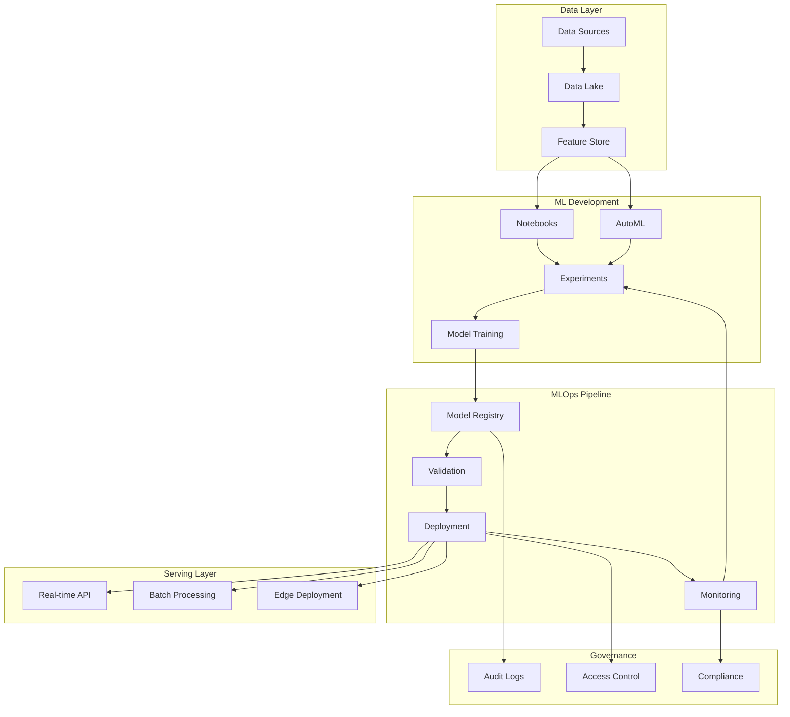
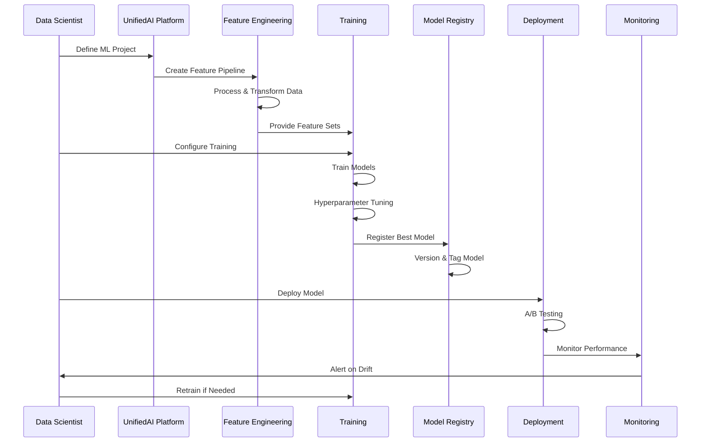
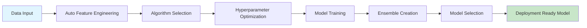
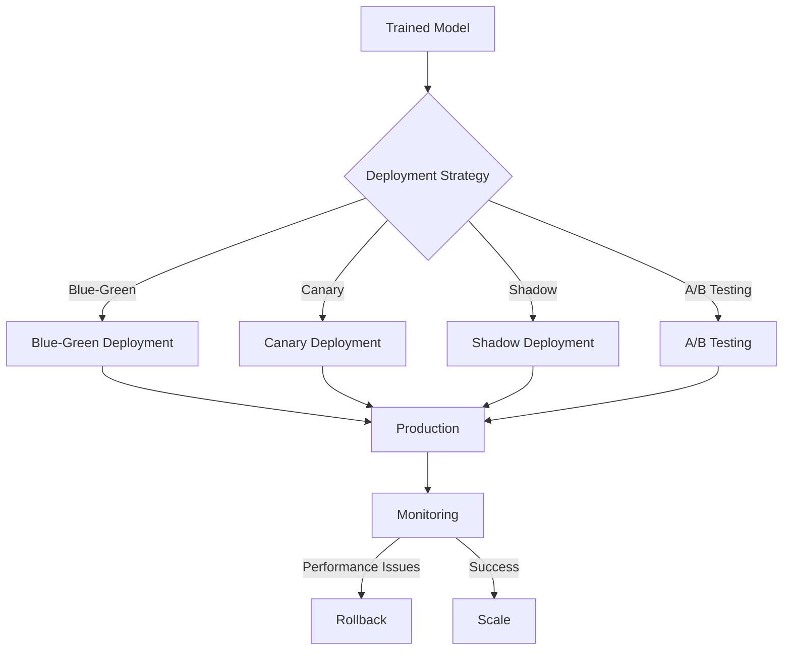
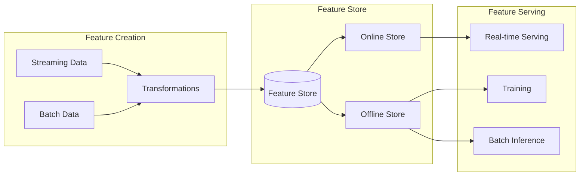
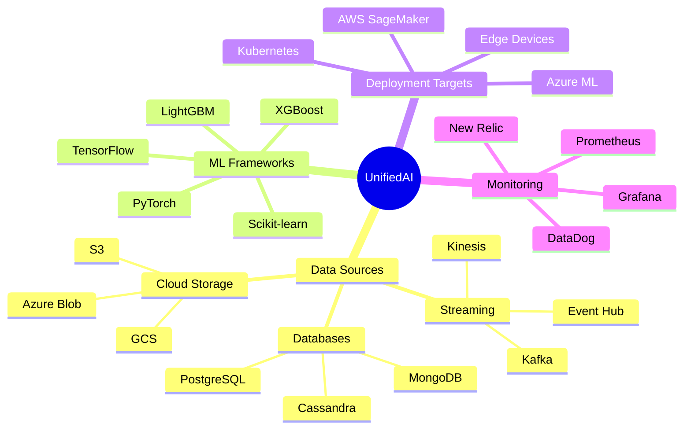

# UnifiedAI Platform

## Enterprise AI Platform for ML at Scale

The UnifiedAI Platform is our strategic enterprise AI platform that accelerates the development, deployment, and management of machine learning models at scale. Built with a cloud-native architecture, it provides a comprehensive MLOps pipeline with enterprise-grade security and governance.

## Platform Architecture

## ML Lifecycle Management

## Key Capabilities

### AutoML Engine

### Model Deployment Strategies

## Feature Store Architecture

## Platform Components

### Core Services
- **Model Registry**: Centralized model versioning and management
- **Feature Store**: Consistent feature engineering and serving
- **Experiment Tracking**: Comprehensive tracking of ML experiments
- **Pipeline Orchestration**: Automated ML workflow management

### Development Tools
- **Jupyter Hub**: Collaborative notebook environment
- **AutoML Studio**: No-code model development
- **SDK & APIs**: Programmatic access to all platform features
- **CLI Tools**: Command-line interface for automation

### Deployment Options
- **Real-time APIs**: REST and gRPC endpoints
- **Batch Processing**: Scheduled batch inference
- **Edge Deployment**: Model deployment to edge devices
- **Streaming**: Real-time stream processing

### Monitoring & Governance
- **Model Monitoring**: Drift detection and performance tracking
- **A/B Testing**: Controlled model rollout and testing
- **Audit Logging**: Complete audit trail of all activities
- **Access Control**: Role-based access control (RBAC)

## Integration Ecosystem

## Success Metrics

### Platform Performance
- **Model Training**: 70% faster than traditional approaches
- **Deployment Time**: From weeks to hours
- **Model Accuracy**: 15-20% improvement on average
- **Resource Utilization**: 40% reduction in compute costs

### Business Impact
- **Time to Market**: 3x faster model deployment
- **Productivity**: 5x increase in data scientist productivity
- **Scalability**: Support for 1000+ concurrent models
- **Reliability**: 99.9% platform availability

## Use Cases

### Financial Services
- Credit risk scoring
- Fraud detection
- Customer churn prediction
- Portfolio optimization

### Healthcare
- Disease prediction
- Patient risk stratification
- Treatment recommendation
- Medical image analysis

### Retail
- Demand forecasting
- Recommendation systems
- Price optimization
- Customer segmentation

### Manufacturing
- Predictive maintenance
- Quality control
- Supply chain optimization
- Energy consumption prediction

## Getting Started

### Prerequisites
- Cloud account (AWS/Azure/GCP)
- Docker and Kubernetes knowledge
- Basic ML understanding

### Quick Start
1. **Environment Setup**: Configure cloud resources
2. **Data Connection**: Connect your data sources
3. **Feature Engineering**: Create feature pipelines
4. **Model Development**: Train your first model
5. **Deployment**: Deploy to production
6. **Monitoring**: Set up monitoring dashboards

## Best Practices

### Data Management
- Implement data versioning
- Maintain feature documentation
- Ensure data quality checks
- Regular data validation

### Model Development
- Use experiment tracking
- Implement proper validation
- Document model assumptions
- Version control everything

### Deployment
- Start with shadow deployments
- Implement gradual rollouts
- Monitor key metrics
- Have rollback strategies

### Governance
- Maintain model lineage
- Regular model audits
- Implement access controls
- Document decision processes