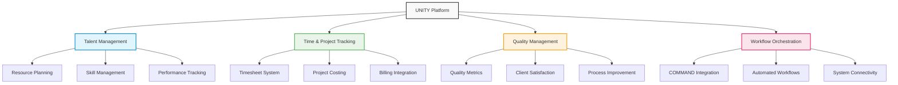

# UNITY - GCC Management Solution

## Overview

UNITY is Accion's comprehensive Global Capability Center (GCC) management solution designed to optimize operations across distributed teams and locations. With a strategic investment of $100K in CY25, this mature internal platform has delivered over $2M in total operational savings, representing a 20:1 ROI while standardizing processes across 23 entities.

## Key Features

### Talent Module
Comprehensive resource management and talent planning system that provides end-to-end visibility into team capabilities, availability, and development needs.

**Business Value**: Optimized resource allocation and improved talent utilization, enabling better project staffing decisions and career development planning.

### Timesheet Functionality
Integrated time tracking and reporting system with project alignment that provides accurate billing data and project cost insights.

**Business Value**: Accurate project costing and improved billing transparency, enabling better financial management and client relationships.

### Quality Management
Performance monitoring and continuous improvement tracking system that measures service quality metrics and identifies optimization opportunities.

**Business Value**: Enhanced service quality and client satisfaction through data-driven performance management and continuous improvement.

### COMMAND Integration
Seamless workflow orchestration platform that connects all GCC operations, enabling automated workflows and improved process coordination.

**Business Value**: Streamlined operations and improved process efficiency through automation and integration of previously siloed systems.

## Business Impact Metrics

| Metric | Value | Impact |
|--------|-------|--------|
| **Cost Savings** | $200K annually | licensing cost savings |
| **Total Operational Savings** | $2M+ | across all functions |
| **Process Standardization** | 23 entities | consistent processes across all entities |
| **Efficiency Gains** | Streamlined | GCC operations |

## Technology Stack

- **Custom Web Platform**: Tailored solution for GCC-specific requirements
- **Workflow Automation**: Process automation and orchestration capabilities
- **Database Management**: Scalable data management and reporting
- **Reporting Engine**: Comprehensive analytics and dashboard capabilities
- **Integration APIs**: Seamless connectivity with existing systems

## Internal Value Creation

### Resource Optimization
Better talent utilization and planning through comprehensive visibility into team capabilities, capacity, and performance metrics.

### Process Standardization
Consistent operational approaches across all GCC locations, reducing complexity and improving efficiency while maintaining quality standards.

### Data-Driven Decisions
Analytics-based management insights that enable informed decision-making for resource allocation, process optimization, and strategic planning.

### Scalable Operations
Platform architecture ready for organizational growth, supporting expansion into new locations and service lines without significant infrastructure changes.

## Platform Architecture

## Operational Benefits

### For Management
- Real-time visibility into GCC operations
- Data-driven insights for strategic planning
- Standardized processes across all locations
- Improved cost management and profitability

### For Project Managers
- Better resource allocation and planning
- Accurate project tracking and reporting
- Improved quality management capabilities
- Streamlined workflow coordination

### For Team Members
- Clear visibility into expectations and performance
- Simplified time tracking and reporting
- Better career development planning
- Improved work-life balance through better resource planning

## Investment and Returns

- **CY25 Investment**: $100K (12% of total platform investment)
- **Total Operational Savings**: $2M+ across all functions
- **ROI Ratio**: 20:1
- **Annual Licensing Savings**: $200K
- **Scope**: 23 entities with standardized processes

## Strategic Significance

UNITY demonstrates Accion's commitment to operational excellence and internal innovation. As a mature platform that has delivered significant cost savings and operational improvements, it showcases our ability to develop sophisticated enterprise solutions that scale across complex organizational structures.

### Internal Innovation Leadership
UNITY serves as a proof point for our platform development capabilities, demonstrating our ability to build comprehensive enterprise solutions that deliver measurable business value.

### Operational Excellence
The platform's success in standardizing processes across 23 entities while delivering significant cost savings establishes Accion as a leader in operational optimization.

### Scalability Framework
UNITY's architecture provides a framework for managing distributed teams and operations that can be adapted for client implementations and new business opportunities.

## Future Enhancements

### AI-Powered Analytics
Integration of artificial intelligence for predictive resource planning, performance optimization, and automated insights generation.

### Mobile Optimization
Enhanced mobile capabilities for field teams and remote workers, improving accessibility and user experience.

### Advanced Integration
Expanded integration capabilities with third-party systems and platforms, enabling broader ecosystem connectivity.

### Global Expansion Features
Enhanced support for multi-currency, multi-language, and region-specific compliance requirements as operations expand globally.

## Market Opportunity

While UNITY is primarily an internal platform, its success demonstrates Accion's capability to develop comprehensive enterprise management solutions. The platform's architecture and capabilities could be adapted for client implementations in similar distributed team management scenarios, creating potential new revenue opportunities.

## Conclusion

UNITY represents a significant success story in internal platform development, delivering substantial operational savings while improving service quality and standardization. Its success validates Accion's platform development capabilities and provides a foundation for future innovation in enterprise management solutions.