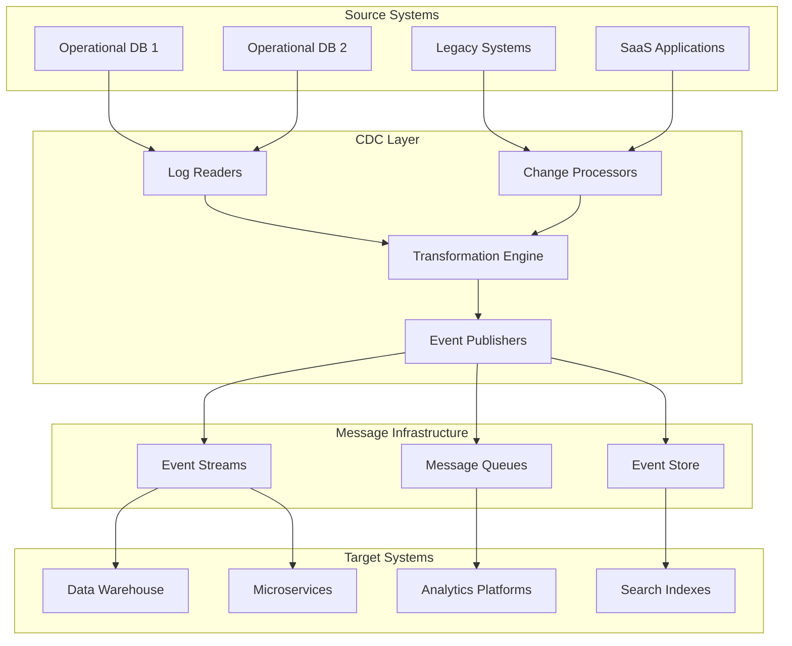

# Change Data Capture Tools

## Overview
Change Data Capture (CDC) Tools provide real-time data synchronization and event processing with minimal system impact. This component enables real-time data integration and system decoupling for modern architectures while maintaining data consistency across distributed systems.

## Core Capabilities

### Real-time Data Synchronization
- Near real-time change capture and propagation
- Low-latency data replication
- Event-driven architecture support
- Minimal impact on source systems

### Event Processing
- Change event enrichment and transformation
- Event routing and distribution
- Event ordering and deduplication
- Failure handling and retry logic

### System Integration
- Database-agnostic CDC implementation
- Message queue integration
- API-based change propagation
- Batch and streaming mode support

## Technical Architecture

## Key Features

### Multiple CDC Methods
- Log-based CDC for databases
- Trigger-based change capture
- Query-based polling mechanisms
- API-based change notifications

### Event Streaming
- Apache Kafka integration
- Event schema management
- Stream processing capabilities
- Event replay and recovery

### Transformation Engine
- Real-time data transformation
- Field-level change tracking
- Business rule application
- Data enrichment and validation

## Performance Metrics

### Processing Performance
- **Latency**: <100ms from source change to target delivery
- **Throughput**: 100K+ events per second processing capacity
- **System Impact**: <5% overhead on source systems
- **Availability**: 99.9% uptime with automatic failover

### Business Impact
- 90% reduction in batch processing dependencies
- Real-time analytics and decision making
- Improved system decoupling and flexibility
- Enhanced disaster recovery capabilities

## Use Cases

### Real-time Data Warehousing
Enable real-time analytics with continuous data warehouse updates.

### System Integration
Integrate systems with minimal coupling and maximum flexibility.

### Event-Driven Microservices
Support microservices architectures with reliable event propagation.

### Operational Analytics
Enable real-time operational dashboards and monitoring.

## Technology Stack

### Core CDC Technologies
- **Database CDC**: Debezium, Oracle GoldenGate, AWS DMS
- **Streaming**: Apache Kafka, Apache Pulsar, Amazon Kinesis
- **Processing**: Apache Spark Streaming, Apache Flink
- **Monitoring**: Confluent Control Center, Kafka Manager

### Integration Platforms
- Database systems (PostgreSQL, MySQL, Oracle, SQL Server)
- Cloud platforms (AWS, Azure, GCP)
- Message queues (RabbitMQ, Apache ActiveMQ)
- Data platforms (Snowflake, Databricks, BigQuery)

## Implementation Approach

### Assessment Phase (2-3 weeks)
1. Source system analysis and CDC feasibility
2. Data flow mapping and requirements
3. Target system integration assessment
4. Performance and capacity planning

### Setup Phase (4-6 weeks)
1. CDC infrastructure deployment
2. Source system connector configuration
3. Event streaming platform setup
4. Target system integration development

### Testing Phase (2-3 weeks)
1. End-to-end testing and validation
2. Performance testing and optimization
3. Failover and recovery testing
4. Data consistency validation

### Production Phase (2-3 weeks)
1. Production deployment and monitoring
2. Performance tuning and optimization
3. User training and documentation
4. Support and maintenance setup

## Success Stories

### E-commerce Platform
**Challenge**: Inventory updates causing 30-minute delays in product availability
**Solution**: Real-time CDC implementation for inventory synchronization
**Results**: Real-time inventory updates, 40% increase in sales conversion

### Financial Services
**Challenge**: Fraud detection requiring real-time transaction analysis
**Solution**: CDC-powered real-time transaction streaming to ML models
**Results**: 80% faster fraud detection, $10M annual fraud prevention

## CDC Patterns

### Log-based CDC
- Read database transaction logs
- Capture all changes without impacting source
- Guaranteed change capture
- Low latency and high throughput

### Trigger-based CDC
- Database triggers capture changes
- Flexible transformation capabilities
- Custom business logic integration
- Higher source system impact

### Query-based CDC
- Periodic queries for changed records
- Works with any database system
- Higher latency but simple implementation
- Good for systems without log access

## Data Consistency Strategies

### At-Least-Once Delivery
- Guaranteed message delivery
- Possible duplicate processing
- Idempotent consumer design required

### Exactly-Once Processing
- No duplicate processing
- Complex implementation
- Higher resource requirements
- Suitable for critical applications

### Eventually Consistent
- High performance and availability
- Temporary inconsistencies acceptable
- Conflict resolution strategies
- Suitable for distributed systems

## Differentiators

- **Ultra-Low Latency**: Sub-100ms change propagation
- **Minimal Impact**: <5% overhead on source systems
- **Fault Tolerant**: Automatic recovery and replay capabilities
- **Scalable**: Horizontal scaling for high-volume scenarios
- **Universal**: Support for diverse database and system types

## Getting Started

Transform your data integration strategy with real-time Change Data Capture. Enable event-driven architectures and real-time analytics with reliable, low-latency data synchronization.

**Next Steps:**
1. Assess current integration architecture
2. Identify CDC use cases and priorities
3. Design CDC implementation strategy
4. Deploy pilot CDC implementation