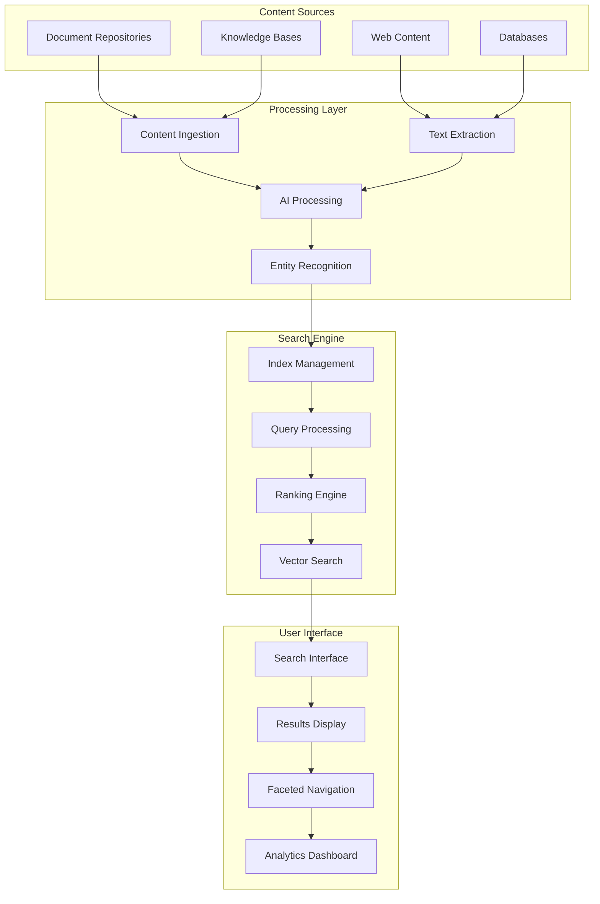

# Cognitive Search - Enterprise Search Engine

## Overview
The Cognitive Search component provides advanced search capabilities with contextual understanding and intelligent relevance. This component transforms enterprise content discovery through AI-powered search, delivering 40% faster information retrieval and significantly improved user experience.

## Core Capabilities

### Intelligent Search
- Natural language query processing
- Contextual understanding and intent recognition
- AI-powered relevance ranking
- Multi-modal search (text, images, documents)

### Content Processing
- Automatic content indexing and cataloging
- Entity extraction and relationship mapping
- Semantic analysis and categorization
- Multi-format content support

### User Experience
- Intuitive search interfaces
- Auto-complete and search suggestions
- Faceted search and filtering
- Personalized search results

## Technical Architecture

## Key Features

### Elasticsearch Integration
- High-performance search indexing
- Distributed search architecture
- Advanced query capabilities
- Real-time index updates

### Vector Search
- Semantic similarity matching
- AI embedding generation
- Contextual search results
- Multi-language support

### Relevance Tuning
- Machine learning-powered ranking
- User behavior analysis
- Search result optimization
- A/B testing capabilities

## Performance Metrics

### Search Performance
- **Retrieval Speed**: 40% faster than traditional search
- **Query Response Time**: <200ms average response
- **Index Updates**: Real-time content indexing
- **Concurrent Users**: Support for 10,000+ simultaneous searches

### User Experience
- **Relevance Score**: 85%+ user satisfaction rating
- **Search Success Rate**: 90%+ queries return relevant results
- **User Engagement**: 60% increase in content discovery
- **Time to Find**: 50% reduction in search time

## Use Cases

### Knowledge Management
Transform enterprise knowledge discovery with intelligent search across all content types.

### Customer Support
Enable faster issue resolution with smart search across support documentation.

### Legal and Compliance
Accelerate legal research and compliance verification with precision search.

### Content Discovery
Enhance content platforms with AI-powered discovery and recommendations.

## Technology Stack

### Search Technologies
- **Search Engine**: Elasticsearch, Apache Solr, Amazon CloudSearch
- **AI/ML**: OpenAI, Hugging Face, spaCy, BERT
- **Vector DB**: Pinecone, Weaviate, Qdrant
- **Analytics**: Apache Spark, Python, R

### Integration Platforms
- Content management systems (SharePoint, Confluence)
- Document repositories (Box, Dropbox, Google Drive)
- Databases (PostgreSQL, MongoDB, Oracle)
- Web platforms (WordPress, Drupal)

## Implementation Approach

### Discovery Phase (2-3 weeks)
1. Content source inventory and analysis
2. Search requirements gathering
3. User experience design
4. Architecture planning

### Development Phase (6-8 weeks)
1. Search infrastructure setup
2. Content ingestion pipeline development
3. AI model training and optimization
4. User interface development

### Testing Phase (3-4 weeks)
1. Search relevance testing and tuning
2. Performance optimization
3. User acceptance testing
4. Security and compliance validation

### Deployment Phase (2-3 weeks)
1. Production deployment and monitoring
2. User training and adoption
3. Performance monitoring and optimization
4. Continuous improvement setup

## Success Stories

### Global Consulting Firm
**Challenge**: 500,000+ documents across multiple systems, poor findability
**Solution**: Cognitive search implementation with AI-powered relevance
**Results**: 60% faster document discovery, 40% increase in knowledge reuse

### Healthcare Organization
**Challenge**: Medical professionals spending 30% of time searching for information
**Solution**: Intelligent search across medical databases and documentation
**Results**: 50% reduction in search time, improved patient care efficiency

## Search Capabilities

### Natural Language Processing
- Intent recognition and query understanding
- Named entity recognition and extraction
- Sentiment analysis and classification
- Multi-language support and translation

### Semantic Search
- Vector-based similarity matching
- Conceptual search beyond keywords
- Context-aware result ranking
- Relationship discovery

### Visual Search
- Image recognition and tagging
- Visual similarity matching
- OCR and document analysis
- Multi-modal search integration

## Advanced Features

### Fuzzy Search
- Typo tolerance and error correction
- Phonetic matching algorithms
- Approximate string matching
- Smart auto-correction

### Contextual Highlighting
- Query term highlighting in results
- Context-aware snippet generation
- Relevant passage extraction
- Visual result enhancement

### Auto-complete
- Intelligent query suggestions
- Popular search recommendations
- Personalized suggestions
- Real-time completion

## Analytics and Insights

### Search Analytics
- Query analysis and optimization
- User behavior tracking
- Content gap identification
- Performance monitoring

### Business Intelligence
- Search trend analysis
- Content usage patterns
- User engagement metrics
- ROI measurement

## Differentiators

- **AI-Powered**: Machine learning for intelligent search and ranking
- **Contextual Understanding**: Goes beyond keyword matching
- **Multi-modal**: Supports text, images, and documents
- **Real-time**: Instant indexing and search capabilities
- **Personalized**: Adapts to user preferences and behavior

## Getting Started

Transform your enterprise search capabilities with AI-powered cognitive search. Enable faster information discovery and improve user productivity across your organization.

**Next Steps:**
1. Assess current search challenges and requirements
2. Inventory content sources and types
3. Design search architecture and user experience
4. Implement pilot search application