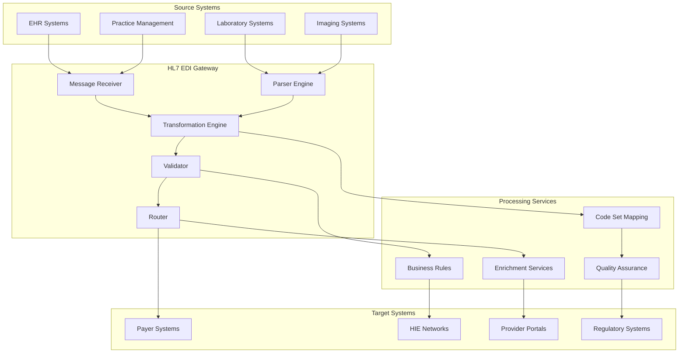

# HL7 EDI Gateway - Healthcare Data Exchange

## Overview
The HL7 EDI Gateway provides standards-compliant healthcare data transformation and exchange supporting interoperability. This component enables seamless healthcare system integration through standardized protocols, reducing integration costs and ensuring regulatory compliance.

## Core Capabilities

### Standards Compliance
- HL7 v2.x and v3 message processing
- FHIR R4 resource management
- X12 EDI transaction support
- HIPAA transaction standards compliance

### Data Transformation
- Bi-directional message transformation
- Format conversion and mapping
- Code set translation and validation
- Custom transformation rules

### Integration Services
- Real-time and batch processing modes
- Message routing and orchestration
- Error handling and retry logic
- Comprehensive logging and monitoring

## Technical Architecture

## Key Features

### HL7 Message Processing
- ADT (Admission, Discharge, Transfer) messages
- ORM/OBR (Order Entry/Observation Request)
- ORU/OBX (Observation Result/Observation Value)
- SIU/SCH (Scheduling Information/Schedule)

### FHIR Integration
- RESTful FHIR API endpoints
- Resource CRUD operations
- FHIR search and query capabilities
- Bulk data export and import

### EDI Transaction Support
- 837 (Healthcare Claim)
- 835 (Healthcare Claim Payment/Advice)
- 270/271 (Eligibility Inquiry/Response)
- 276/277 (Claim Status Inquiry/Response)

## Performance Metrics

### Integration Performance
- **Message Throughput**: 10,000+ messages per hour
- **Processing Latency**: <2 seconds average processing time
- **Success Rate**: 99.9% message processing success
- **Downtime**: <0.1% system availability

### Business Impact
- 40% reduction in integration development costs
- 60% faster time-to-market for new integrations
- 100% standards compliance achievement
- 80% reduction in data quality issues

## Use Cases

### Provider System Integration
Connect EHR systems with payer networks and HIE platforms.

### Payer-Provider Data Exchange
Enable seamless claims processing and eligibility verification.

### Clinical Data Sharing
Share lab results, imaging reports, and clinical summaries.

### Population Health Management
Aggregate and exchange population health data across networks.

## Technology Stack

### Healthcare Standards
- **HL7**: HAPI FHIR, HL7 v2.x processors
- **EDI**: X12 parsers, HIPAA transaction sets
- **Terminology**: SNOMED CT, ICD-10, CPT, LOINC
- **Security**: OAuth 2.0, SMART on FHIR, PKI

### Integration Platform
- **ESB**: Apache Camel, MuleSoft, WSO2
- **Databases**: PostgreSQL, MongoDB, Oracle
- **Messaging**: Apache Kafka, RabbitMQ, ActiveMQ
- **Monitoring**: ELK Stack, Prometheus, Grafana

## Implementation Approach

### Analysis Phase (3-4 weeks)
1. Current integration landscape assessment
2. Standards compliance gap analysis
3. Interoperability requirements gathering
4. Technical architecture design

### Development Phase (8-12 weeks)
1. HL7 EDI Gateway platform setup
2. Message transformation development
3. Integration endpoint configuration
4. Testing and validation framework

### Testing Phase (4-6 weeks)
1. Standards compliance testing
2. Integration testing with systems
3. Performance and load testing
4. Security and compliance validation

### Deployment Phase (3-4 weeks)
1. Production deployment and go-live
2. System integration and cutover
3. User training and support
4. Monitoring and optimization

## Success Stories

### Multi-Hospital Health System
**Challenge**: 15 hospitals with incompatible systems needing data exchange
**Solution**: Centralized HL7 EDI Gateway for all integrations
**Results**: 50% reduction in integration costs, seamless data flow

### Regional HIE
**Challenge**: 200+ providers needing standardized data exchange
**Solution**: FHIR-based gateway with HL7 v2 support
**Results**: 95% provider participation, real-time data sharing

## Healthcare Standards Support

### HL7 v2.x Messages
- Patient administration (ADT)
- Order entry and results (ORM, ORU)
- Scheduling and appointment (SIU)
- Financial management (DFT, BAR)

### FHIR Resources
- Patient, Practitioner, Organization
- Encounter, Procedure, Medication
- Observation, DiagnosticReport, Condition
- Coverage, ExplanationOfBenefit, Claim

### X12 EDI Transactions
- Claims submission and processing
- Eligibility and benefit verification
- Claim status and payment advice
- Prior authorization and referrals

## Security and Compliance

### HIPAA Compliance
- Administrative, physical, technical safeguards
- Data encryption in transit and at rest
- Access controls and audit logging
- Business associate agreement compliance

### Data Security
- Message-level encryption
- Certificate-based authentication
- VPN and secure communication channels
- Comprehensive audit trails

### Privacy Protection
- Data minimization principles
- Consent management integration
- De-identification capabilities
- Right of access and portability

## Integration Patterns

### Point-to-Point Integration
- Direct system connections
- Custom message transformations
- Dedicated communication channels
- High-performance processing

### Hub-and-Spoke Model
- Centralized gateway architecture
- Standardized message formats
- Shared transformation services
- Scalable integration platform

### Event-Driven Architecture
- Real-time event processing
- Asynchronous message handling
- Event sourcing and replay
- Microservices integration

## Monitoring and Management

### Real-time Monitoring
- Message flow tracking and visualization
- Performance metrics and alerts
- Error detection and notification
- System health dashboards

### Business Intelligence
- Integration analytics and reporting
- Message volume and trend analysis
- Performance optimization insights
- Compliance monitoring and reporting

## Differentiators

- **Standards Expertise**: Deep healthcare standards knowledge and implementation
- **Proven Interoperability**: Successful integrations across healthcare ecosystem
- **Compliance Ready**: Built-in HIPAA and healthcare regulation compliance
- **Scalable Architecture**: Supports high-volume, mission-critical integrations
- **Comprehensive Support**: Full lifecycle integration services and support

## Getting Started

Enable seamless healthcare data exchange with our HL7 EDI Gateway. Connect your healthcare systems with standards-compliant, secure, and scalable integration.

**Next Steps:**
1. Assess current integration challenges and requirements
2. Review healthcare standards compliance needs
3. Design integration architecture and data flows
4. Plan HL7 EDI Gateway implementation strategy