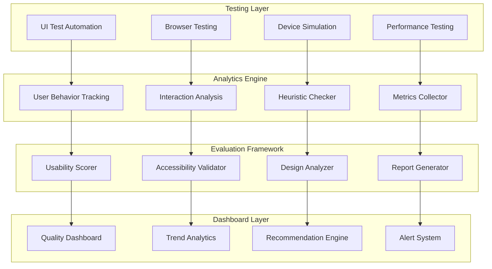

# QUM/QUIDE - UI & Usability Testing

## Overview
QUM/QUIDE provides experience metrics and automated validation for user interfaces with heuristic evaluation. This component ensures consistent user experience quality through objective metrics and evidence-based design decisions, improving user satisfaction and product success.

## Core Capabilities

### Automated UI Testing
- Comprehensive user interface validation
- Cross-browser and cross-device testing
- Accessibility compliance verification
- Performance and usability metrics

### Experience Metrics
- User behavior analytics and tracking
- Interaction pattern analysis
- Task completion and success rates
- User satisfaction scoring

### Heuristic Evaluation
- Automated usability principles checking
- Design consistency validation
- Navigation and workflow analysis
- Content quality assessment

## Technical Architecture

## Key Features

### UI Testing Frameworks
- Selenium WebDriver integration
- Cypress and Playwright support
- Mobile testing with Appium
- Visual regression testing

### User Analytics
- Real-time user behavior tracking
- Heat mapping and click analysis
- User journey mapping
- A/B testing integration

### Accessibility Validation
- WCAG 2.1 compliance checking
- Screen reader compatibility testing
- Keyboard navigation validation
- Color contrast and visual testing

## Performance Metrics

### Testing Efficiency
- **UI Quality Score**: 90%+ quality rating achievement
- **Testing Speed**: 60% faster UI validation
- **Coverage**: 95% UI component test coverage
- **Defect Detection**: 85% UI issues caught pre-production

### User Experience Impact
- 40% improvement in user task completion rates
- 25% increase in user satisfaction scores
- 50% reduction in user interface defects
- 30% faster user onboarding and adoption

## Use Cases

### Digital Product UX Optimization
Optimize web and mobile applications for maximum user experience quality.

### Web Application Quality Assurance
Comprehensive testing of web applications across browsers and devices.

### Mobile App User Experience Testing
Validate mobile app usability and accessibility across platforms.

### Design System Validation
Ensure design system consistency and quality across products.

## Technology Stack

### Testing Technologies
- **UI Testing**: Selenium, Cypress, Playwright, Puppeteer
- **Mobile Testing**: Appium, Espresso, XCUITest
- **Visual Testing**: Percy, Applitools, Chromatic
- **Performance**: Lighthouse, WebPageTest, GTmetrix

### Analytics Platforms
- **User Analytics**: Google Analytics, Mixpanel, Amplitude
- **Heat Mapping**: Hotjar, Crazy Egg, FullStory
- **A/B Testing**: Optimizely, Google Optimize, VWO
- **Accessibility**: aXe, WAVE, Pa11y

## Implementation Approach

### Assessment Phase (2-3 weeks)
1. Current UI/UX quality baseline assessment
2. Testing requirements and scope definition
3. Tool selection and architecture planning
4. Success metrics and KPI definition

### Setup Phase (4-6 weeks)
1. QUM/QUIDE platform configuration
2. Test automation framework setup
3. Analytics and tracking implementation
4. Dashboard and reporting configuration

### Testing Phase (3-4 weeks)
1. Comprehensive UI testing execution
2. User behavior analysis and insights
3. Accessibility compliance validation
4. Performance optimization recommendations

### Optimization Phase (Ongoing)
1. Continuous testing and monitoring
2. User experience optimization
3. Design system maintenance
4. Quality metrics tracking and reporting

## Success Stories

### E-commerce Platform
**Challenge**: High cart abandonment rates due to poor checkout UX
**Solution**: Comprehensive UI testing and optimization with QUM/QUIDE
**Results**: 35% reduction in cart abandonment, 20% increase in conversions

### SaaS Application
**Challenge**: Users struggling with complex interface, high support tickets
**Solution**: Heuristic evaluation and usability testing implementation
**Results**: 50% reduction in support tickets, 40% improvement in user satisfaction

## UI Testing Capabilities

### Functional Testing
- Form validation and submission testing
- Navigation and link verification
- Interactive element testing
- Data input and output validation

### Cross-Browser Testing
- Browser compatibility verification
- Responsive design validation
- JavaScript and CSS testing
- Progressive enhancement testing

### Performance Testing
- Page load speed analysis
- Resource optimization assessment
- Mobile performance evaluation
- Core Web Vitals measurement

## Usability Evaluation

### Heuristic Analysis
- Nielsen's 10 usability heuristics
- Custom usability rule sets
- Industry-specific guidelines
- Design pattern compliance

### User Experience Metrics
- Task success and completion rates
- Time on task and efficiency metrics
- Error rates and recovery analysis
- User satisfaction and preference scoring

### Accessibility Assessment
- WCAG compliance level validation
- Screen reader compatibility testing
- Keyboard navigation assessment
- Color contrast and visual accessibility

## Advanced Features

### AI-Powered Analysis
- Machine learning-based pattern recognition
- Automated usability issue detection
- Predictive user behavior analysis
- Intelligent recommendation generation

### Visual Testing
- Pixel-perfect visual regression testing
- Layout and design consistency validation
- Cross-device visual comparison
- Brand guideline compliance checking

### User Journey Analysis
- Complete user flow mapping
- Drop-off point identification
- Conversion funnel optimization
- Multi-channel experience tracking

## Quality Metrics

### Usability Metrics
- System Usability Scale (SUS) scoring
- Task completion success rates
- Time to complete key user tasks
- Error frequency and severity analysis

### Accessibility Metrics
- WCAG compliance percentage
- Screen reader compatibility score
- Keyboard navigation success rate
- Color contrast compliance rate

### Performance Metrics
- Page load speed optimization
- First Contentful Paint (FCP)
- Largest Contentful Paint (LCP)
- Cumulative Layout Shift (CLS)

## Integration Capabilities

### Development Workflow
- CI/CD pipeline integration
- Pull request testing automation
- Code quality gate enforcement
- Continuous monitoring setup

### Design Tool Integration
- Figma, Sketch, Adobe XD connectivity
- Design specification validation
- Component library synchronization
- Design-to-development handoff

## Differentiators

- **Comprehensive Coverage**: Complete UI/UX quality assessment
- **Evidence-Based**: Objective metrics and data-driven insights
- **Automation-First**: Extensive automation for efficiency and consistency
- **User-Centric**: Focus on actual user experience and satisfaction
- **Continuous Improvement**: Ongoing monitoring and optimization

## Getting Started

Transform your digital product quality with QUM/QUIDE. Ensure exceptional user experiences through comprehensive UI testing and usability validation.

**Next Steps:**
1. Assess current UI/UX quality and testing processes
2. Define quality standards and success metrics
3. Plan QUM/QUIDE implementation and integration
4. Begin comprehensive UI testing and optimization