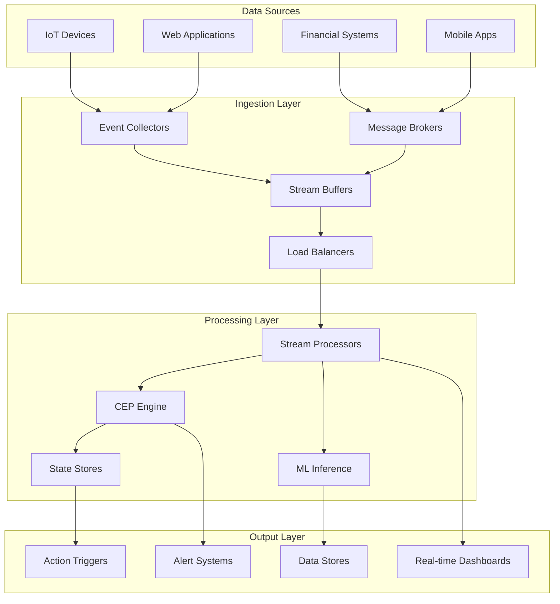

# Streaming Data - Real-time Processing

## Overview
The Streaming Data component provides high-throughput data ingestion with stream processing capabilities for millisecond response times. This component enables real-time analytics and immediate response to business events, supporting modern data-driven applications that require instant insights.

## Core Capabilities

### High-Throughput Ingestion
- Million+ events per second processing
- Auto-scaling based on load
- Multi-protocol support (HTTP, TCP, UDP, WebSocket)
- Batch and micro-batch processing modes

### Stream Processing
- Real-time data transformation and enrichment
- Complex event processing (CEP)
- Windowing and aggregation functions
- State management for stateful processing

### Event Analytics
- Real-time pattern detection
- Anomaly identification and alerting
- Time-series analysis and forecasting
- Machine learning model scoring

## Technical Architecture

## Key Features

### Apache Kafka Integration
- High-throughput message streaming
- Fault-tolerant event storage
- Schema registry for event evolution
- Multi-consumer pattern support

### Event Processing Engine
- SQL-like stream processing
- Custom function support
- Join operations across streams
- Temporal operations and windowing

### Real-time Analytics
- Continuous query processing
- Real-time aggregations and metrics
- Pattern matching and correlation
- Machine learning inference

## Performance Metrics

### Processing Performance
- **Latency**: <100 milliseconds end-to-end processing
- **Throughput**: 1M+ events per second sustained
- **Scalability**: Linear scaling with additional resources
- **Availability**: 99.99% uptime with automatic failover

### Business Impact
- Real-time decision making capabilities
- Immediate response to critical events
- Reduced time-to-insight from hours to milliseconds
- Enhanced customer experience through instant responses

## Use Cases

### IoT Data Processing
Process sensor data in real-time for immediate insights and automated responses.

### Financial Transaction Monitoring
Monitor transactions for fraud detection and risk management in real-time.

### Operational Monitoring
Real-time monitoring of system performance and business metrics.

### Customer Experience Optimization
Real-time personalization and recommendation engines.

## Technology Stack

### Streaming Platforms
- **Message Brokers**: Apache Kafka, Apache Pulsar, AWS Kinesis
- **Stream Processing**: Apache Flink, Apache Spark Streaming, Kafka Streams
- **CEP Engines**: Apache Storm, WSO2 Stream Processor
- **State Stores**: Apache Kafka, Redis, Apache Cassandra

### Analytics and ML
- **ML Frameworks**: TensorFlow Serving, MLflow, Seldon
- **Analytics**: Apache Druid, InfluxDB, TimescaleDB
- **Visualization**: Grafana, Apache Superset, Kibana

## Implementation Approach

### Planning Phase (2-3 weeks)
1. Use case identification and prioritization
2. Data flow architecture design
3. Performance and capacity planning
4. Technology stack selection

### Development Phase (6-8 weeks)
1. Streaming infrastructure setup
2. Data ingestion pipeline development
3. Stream processing logic implementation
4. Real-time analytics and dashboards

### Testing Phase (3-4 weeks)
1. Performance testing and optimization
2. Fault tolerance and recovery testing
3. End-to-end integration testing
4. Load testing and capacity validation

### Production Phase (2-3 weeks)
1. Production deployment and monitoring
2. Performance tuning and optimization
3. Operations training and documentation
4. 24/7 monitoring and support setup

## Success Stories

### IoT Manufacturing Platform
**Challenge**: 50,000 sensors generating 10M events per hour, requiring real-time analysis
**Solution**: High-throughput streaming platform with real-time anomaly detection
**Results**: 99.9% equipment uptime, $5M annual maintenance cost savings

### Financial Trading Platform
**Challenge**: Sub-millisecond trading decisions required for competitive advantage
**Solution**: Ultra-low latency streaming with ML-powered decision engines
**Results**: 50ms average decision time, 25% increase in profitable trades

## Streaming Patterns

### Event Sourcing
- Complete event history preservation
- Event replay capabilities
- Audit trail and compliance
- System state reconstruction

### CQRS (Command Query Responsibility Segregation)
- Separate read and write models
- Optimized query performance
- Scalable architecture
- Complex business logic support

### Lambda Architecture
- Batch and stream processing layers
- Fault-tolerant data processing
- Historical and real-time views
- Comprehensive data coverage

### Kappa Architecture
- Stream-only processing
- Simplified architecture
- Real-time and historical processing
- Single processing paradigm

## Real-time Analytics Capabilities

### Time-Series Analysis
- Continuous metric calculation
- Trend detection and forecasting
- Seasonal pattern recognition
- Statistical analysis

### Complex Event Processing
- Pattern matching across event streams
- Temporal event correlation
- Business rule evaluation
- Automated action triggering

### Machine Learning Integration
- Real-time model inference
- Online learning and adaptation
- A/B testing and experimentation
- Predictive analytics

## Differentiators

- **Ultra-Low Latency**: Sub-100ms processing for time-critical applications
- **Massive Scale**: Handle millions of events per second
- **Fault Tolerant**: Automatic recovery and no data loss guarantees
- **Real-time ML**: Integrated machine learning for intelligent processing
- **Cloud Native**: Kubernetes-based deployment for scalability

## Getting Started

Transform your real-time data processing capabilities with our Streaming Data component. Enable instant insights and immediate responses to business events.

**Next Steps:**
1. Identify real-time use cases and requirements
2. Assess current data architecture and gaps
3. Design streaming architecture and data flows
4. Implement pilot streaming application