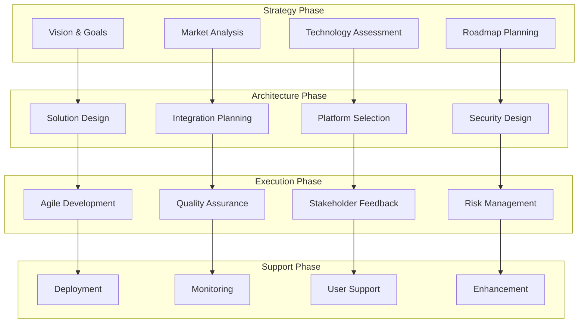

# Innovation Development Lifecycle

## Overview
The Innovation Development Lifecycle provides end-to-end innovation management from strategy to support with a structured approach to digital transformation. This comprehensive framework enables organizations to manage innovation initiatives with predictable timelines and measurable business outcomes.

## Core Stages

### 1. Strategy & Roadmap
- Vision definition and strategic alignment
- Innovation goals and success criteria
- Market analysis and opportunity assessment
- Technology evaluation and selection
- Roadmap development and prioritization

### 2. Solution Architecture  
- Technical design and system blueprints
- Integration architecture and patterns
- Scalability and performance planning
- Security and compliance considerations
- Technology stack and platform selection

### 3. Agile Execution
- Iterative development and delivery
- Continuous integration and deployment
- Quality assurance and testing
- Stakeholder feedback and refinement
- Risk management and mitigation

### 4. Solution Support
- Production deployment and go-live
- Monitoring and performance optimization
- User training and adoption support
- Maintenance and enhancement planning
- Continuous improvement initiatives

## Framework Architecture

## Key Benefits

### Structured Innovation Approach
- Systematic methodology for innovation management
- Proven processes and best practices
- Risk mitigation through structured approach
- Consistent outcomes across initiatives
- Scalable framework for various innovation types

### Predictable Timelines
- Well-defined phases and milestones
- Realistic estimation and planning
- Progress tracking and monitoring
- Early risk identification and mitigation
- Stakeholder expectation management

### Measurable Outcomes
- Clear success criteria and KPIs
- Regular progress assessment and reporting
- Business value measurement and tracking
- Return on investment calculation
- Continuous improvement based on metrics

## Target Scenarios

### Digital Transformation Initiatives
- Enterprise-wide digital transformation
- Legacy system modernization
- Business process digitization
- Customer experience transformation
- Operational efficiency improvements

### Innovation and R&D Projects
- New product development initiatives
- Emerging technology exploration
- Proof of concept and prototyping
- Research and development programs
- Innovation lab initiatives

### Product Modernization Programs
- Legacy product refresh and upgrade
- Technology platform migration
- User experience enhancement
- Performance optimization initiatives
- Feature enhancement programs

## Implementation Approach

### Phase 1: Strategic Planning (4-6 weeks)
1. Innovation vision and strategy development
2. Market opportunity assessment and analysis
3. Technology landscape evaluation
4. Innovation roadmap creation and prioritization
5. Success criteria and KPI definition

### Phase 2: Solution Design (6-8 weeks)
1. Technical architecture design and validation
2. Integration strategy and planning
3. Security and compliance framework
4. Technology platform selection and setup
5. Development approach and methodology

### Phase 3: Agile Execution (12-20 weeks)
1. Iterative development and delivery cycles
2. Continuous testing and quality assurance
3. Regular stakeholder feedback and refinement
4. Risk monitoring and mitigation
5. Progress tracking and reporting

### Phase 4: Solution Support (Ongoing)
1. Production deployment and go-live support
2. Performance monitoring and optimization
3. User training and adoption programs
4. Maintenance and enhancement planning
5. Continuous improvement and innovation

## Success Metrics

### Innovation Performance
- **Time to Market**: 40% reduction in innovation delivery time
- **Success Rate**: 80% of initiatives meeting success criteria
- **ROI Achievement**: 3:1 average return on innovation investment
- **Stakeholder Satisfaction**: 90%+ satisfaction with innovation outcomes

### Business Impact
- Accelerated digital transformation
- Enhanced competitive advantage
- Improved operational efficiency
- Increased customer satisfaction
- Revenue growth through innovation

## Framework Components

### Innovation Strategy Framework
- Vision and goal setting methodologies
- Market analysis and opportunity assessment
- Technology evaluation and selection criteria
- Roadmap development and prioritization
- Success measurement and KPI frameworks

### Solution Architecture Framework
- Technical design patterns and standards
- Integration architecture best practices
- Scalability and performance guidelines
- Security and compliance templates
- Technology platform evaluation criteria

### Agile Execution Framework
- Iterative development methodologies
- Continuous integration and deployment
- Quality assurance and testing strategies
- Stakeholder engagement and feedback loops
- Risk management and mitigation procedures

### Support and Maintenance Framework
- Deployment and go-live procedures
- Monitoring and performance optimization
- User adoption and training programs
- Maintenance and enhancement processes
- Continuous improvement methodologies

## Industry Applications

### Technology Sector
- Product innovation and development
- Platform modernization initiatives
- Emerging technology adoption
- Research and development programs
- Digital product transformation

### Financial Services
- Fintech innovation and digital banking
- Payment system modernization
- Regulatory compliance technology
- Customer experience transformation
- Risk management system innovation

### Healthcare
- Digital health platform development
- Medical device innovation
- Healthcare analytics and AI
- Patient experience improvements
- Clinical workflow optimization

## Differentiators

### Comprehensive Approach
- End-to-end innovation lifecycle management
- Integrated strategy, design, execution, and support
- Holistic view of innovation initiatives
- Coordinated activities across all phases
- Consistent methodology and standards

### Proven Methodology
- Battle-tested approach with demonstrated results
- Industry best practices integration
- Continuous improvement based on experience
- Scalable framework for various innovation types
- Risk mitigation through proven processes

### Measurable Results
- Objective metrics and KPIs
- Regular progress monitoring and reporting
- Business value measurement and tracking
- Return on investment calculation
- Data-driven decision making and optimization

## Getting Started

Accelerate your innovation initiatives with the Innovation Development Lifecycle. Achieve predictable outcomes through structured innovation management and proven methodologies.

**Next Steps:**
1. Assess current innovation processes and capabilities
2. Define innovation strategy and objectives
3. Customize framework for your organization
4. Plan pilot innovation initiative
5. Begin structured innovation development