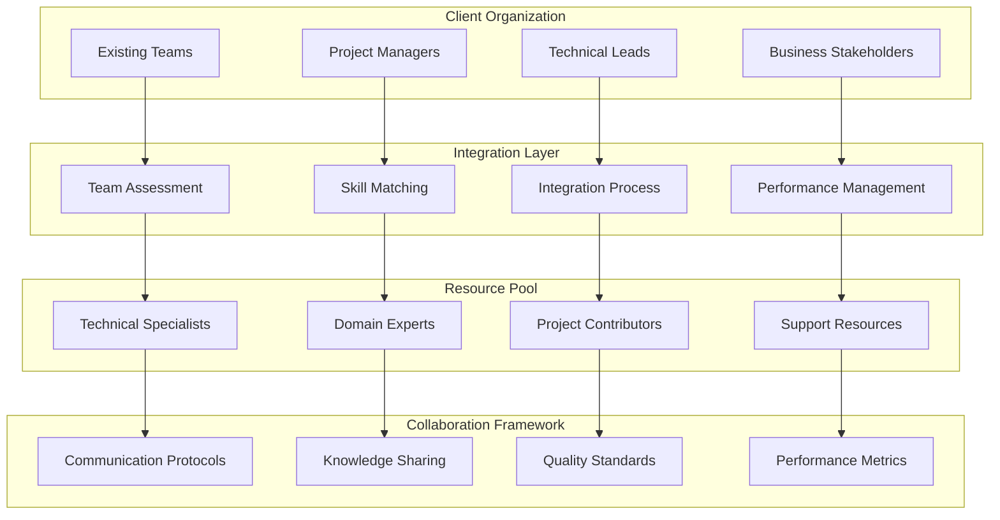

# Integrated Teams Model

## Overview
The Integrated Teams Model provides a client-led collaborative approach with individual contributors seamlessly integrated into existing team structures. This framework enables flexible resource scaling with minimal management overhead while ensuring rapid skill acquisition and knowledge transfer.

## Strategic Value

### Flexible Resource Scaling
- Dynamic team size adjustment based on project needs
- Rapid resource onboarding and off-boarding capabilities
- Cost-effective scaling without long-term commitments
- Immediate access to specialized skills and expertise

### Seamless Integration
- Contributors integrate directly into existing client teams
- Minimal disruption to established team dynamics
- Quick adaptation to client processes and methodologies
- Cultural alignment and collaborative working relationships

### Low Management Overhead
- Reduced administrative burden on client management
- Streamlined communication and coordination processes
- Direct team member interaction and collaboration
- Simplified project management and oversight

## Framework Architecture

## Key Features

### RACI Matrices and Responsibility Frameworks
- Clear definition of roles and responsibilities
- Accountability mapping across team members
- Decision-making authority clarification
- Escalation paths and approval processes

### Resource Integration Processes
- Streamlined onboarding and orientation procedures
- Technical environment setup and access provisioning
- Team introduction and relationship building
- Process alignment and methodology training

### Performance Evaluation Criteria
- Objective performance measurement frameworks
- Regular review and feedback mechanisms
- Skill development and improvement plans
- Recognition and reward systems

## Client Value Proposition

### Rapid Skill Acquisition
- Immediate access to required technical expertise
- Reduced time-to-productivity for new capabilities
- Knowledge transfer through direct collaboration
- Skill enhancement through mentoring and guidance

### Direct Expertise Integration
- Subject matter experts embedded within teams
- Real-time problem-solving and consultation
- Continuous learning and knowledge exchange
- Innovation through diverse perspectives and experience

### Minimal Disruption
- Smooth integration without process overhaul
- Preservation of existing team culture and dynamics
- Gradual capability enhancement and development
- Flexible engagement models and terms

## Target Scenarios

### Team Augmentation Initiatives
- Temporary resource needs for specific projects
- Skill gaps requiring immediate attention
- Peak workload management and support
- Specialized expertise for short-term initiatives

### Specialized Skill Requirements
- Niche technology expertise and knowledge
- Domain-specific experience and understanding
- Advanced technical capabilities and skills
- Innovation and emerging technology adoption

### Flexible Resourcing Needs
- Variable project resource requirements
- Budget constraints requiring flexible arrangements
- Pilot projects and proof-of-concept initiatives
- Transition periods and organizational changes

## Implementation Framework

### Assessment and Planning Phase (1-2 weeks)
1. Current team structure and capability analysis
2. Resource requirement identification and prioritization
3. Integration approach design and planning
4. Success criteria and metrics definition

### Resource Matching Phase (1-2 weeks)
1. Candidate evaluation and skill assessment
2. Cultural fit and team compatibility evaluation
3. Technical alignment and capability verification
4. Final selection and approval processes

### Integration Phase (2-4 weeks)
1. Onboarding and orientation execution
2. Team integration and relationship building
3. Process alignment and methodology training
4. Initial project assignment and execution

### Performance Management Phase (Ongoing)
1. Regular performance review and feedback
2. Skill development and enhancement planning
3. Team dynamics monitoring and optimization
4. Continuous improvement and adjustment

## Success Metrics

### Integration Effectiveness
- **Time to Productivity**: 2 weeks average onboarding time
- **Team Satisfaction**: 85%+ team member satisfaction
- **Cultural Fit**: 90%+ successful team integration
- **Knowledge Transfer**: 80%+ successful knowledge exchange

### Business Impact
- **Project Velocity**: 25% increase in delivery speed
- **Quality Improvement**: 20% reduction in defect rates
- **Cost Efficiency**: 30% cost reduction compared to hiring
- **Flexibility**: 100% resource scaling responsiveness

## Framework Components

### Team Assessment Framework
- Current team capability evaluation
- Skill gap identification and analysis
- Team dynamics and culture assessment
- Integration readiness evaluation

### Resource Matching Process
- Comprehensive candidate evaluation
- Technical and cultural fit assessment
- Experience and expertise verification
- Client approval and selection process

### Integration Methodology
- Structured onboarding procedures
- Team introduction and bonding activities
- Process and methodology alignment
- Performance expectation setting

### Performance Management System
- Regular review and feedback cycles
- Skill development planning and tracking
- Performance improvement initiatives
- Recognition and retention programs

## Best Practices

### Effective Integration
- Clear role definition and expectation setting
- Regular communication and feedback sessions
- Cultural orientation and team building activities
- Gradual responsibility increase and empowerment

### Performance Optimization
- Continuous skill development and enhancement
- Regular performance monitoring and adjustment
- Team collaboration and knowledge sharing
- Innovation and improvement initiatives

### Relationship Management
- Strong stakeholder engagement and communication
- Proactive issue identification and resolution
- Trust building and relationship strengthening
- Long-term partnership development

## Getting Started

Enhance your team capabilities with the Integrated Teams Model. Access specialized expertise while maintaining team cohesion and minimizing management overhead.

**Next Steps:**
1. Assess current team structure and capability gaps
2. Define resource requirements and integration objectives
3. Design integration approach and success criteria
4. Begin resource matching and integration process