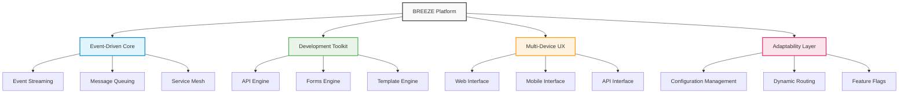

# BREEZE - Containerized Microservices Architecture

## Overview

BREEZE is Accion's mature event-driven microservices architecture platform that has established itself as a cornerstone of our delivery excellence. With over 50% of converted deals influenced by BREEZE, this platform demonstrates proven market value and client confidence in our architectural approach.

## Key Features

### Event-Driven Architecture
Scalable, responsive system design using event streaming that enables loose coupling between services and supports high-volume, real-time data processing.

**Business Value**: Enhanced system responsiveness and scalability, enabling applications to handle varying loads and maintain high availability.

### API/Forms/Templates Engines
Comprehensive development toolkit for rapid application development, providing standardized patterns and reusable components that accelerate development cycles.

**Business Value**: Accelerated development cycles and consistent implementation patterns, reducing time-to-market and maintenance overhead.

### Multi-Device UX
Consistent experience across platforms and devices, ensuring users have the same high-quality experience whether accessing applications via web, mobile, or other interfaces.

**Business Value**: Unified user experience reducing development and maintenance costs while improving user satisfaction and adoption rates.

### Build-for-Change Capabilities
Adaptable architecture designed for evolving business requirements, enabling organizations to quickly respond to market changes and new business opportunities.

**Business Value**: Future-proof solutions that adapt to changing business needs, protecting technology investments and enabling business agility.

## Business Impact Metrics

| Metric | Value | Impact |
|--------|-------|--------|
| **Market Influence** | 50%+ | of converted deals influenced by BREEZE |
| **Time-to-Market** | 35% faster | delivery timelines |
| **Quality Enhancement** | 47% fewer | defects in delivered solutions |
| **Communication Efficiency** | 44% less | translation loss between teams |

## Technology Stack

- **Microservices**: Distributed architecture pattern for scalable applications
- **Kafka**: Event streaming platform for real-time data processing
- **Docker**: Containerization for consistent deployment environments
- **Kubernetes**: Container orchestration for scalable deployment and management

## Strategic Value

### Delivery Acceleration
Proven framework for faster project delivery with established patterns and best practices that reduce development time and improve predictability.

### Quality Assurance
Consistent, high-quality outcomes through standardized architecture patterns and automated testing frameworks built into the platform.

### Client Confidence
Established track record of success with over 50% of converted deals being influenced by BREEZE capabilities, demonstrating market validation and client trust.

### Competitive Advantage
Proprietary architecture approach that differentiates Accion in the marketplace and provides unique value propositions to clients.

## Target Industries

- **Financial Services**: High-volume transaction processing, regulatory compliance, real-time risk management
- **Retail**: E-commerce platforms, inventory management, customer experience optimization
- **Technology**: SaaS platforms, API ecosystems, scalable application architectures

## Platform Architecture

## Implementation Benefits

### For Development Teams
- Standardized patterns reduce learning curve
- Automated tooling accelerates development
- Built-in best practices ensure quality
- Comprehensive documentation and examples

### For Business Stakeholders
- Faster time-to-market for new features
- Reduced technical debt and maintenance costs
- Improved system reliability and performance
- Enhanced ability to scale with business growth

### For End Users
- Consistent experience across all touchpoints
- Better performance and responsiveness
- Enhanced security and data protection
- Seamless integration with existing systems

## Market Position

BREEZE has established Accion as a leader in enterprise architecture solutions, with its influence on over 50% of converted deals demonstrating strong market validation. The platform's mature capabilities and proven track record make it a cornerstone of our competitive advantage in the enterprise technology market.

## Future Roadmap

- Enhanced AI integration for intelligent routing and optimization
- Expanded cloud-native capabilities for multi-cloud deployments
- Advanced analytics and monitoring capabilities
- Integration with emerging technologies like serverless computing