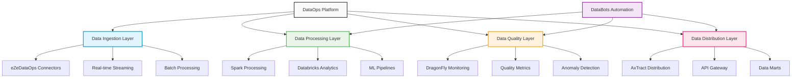

# DataOps - Data Lake Platform Blueprint

## Overview

DataOps is Accion's comprehensive data lake platform blueprint that provides end-to-end data management capabilities for modern enterprises. With a strategic investment of $100K in CY25, this mature platform delivers projected returns of $200K, representing a 2:1 ROI while influencing 50% of data line-of-business opportunities.

## Key Features

### eZeDataOps Integration
Streamlined data operations platform with automated workflows that orchestrate data ingestion, processing, and delivery across enterprise systems.

**Business Value**: Reduced manual data processing effort and improved operational efficiency, enabling data teams to focus on analytics rather than infrastructure management.

### DragonFly Quality Monitoring
Real-time data quality assessment and alerting system that continuously monitors data pipelines for anomalies, inconsistencies, and quality degradation.

**Business Value**: Proactive data quality management and issue prevention, ensuring downstream analytics and decisions are based on reliable, high-quality data.

### AxTract Data Sharing
Secure, automated data distribution platform that enables controlled data sharing across systems, departments, and external partners while maintaining governance and compliance.

**Business Value**: Enhanced data accessibility and reduced data silos, promoting data democratization while maintaining security and compliance standards.

### DataBots Automation
Intelligent data processing automation powered by machine learning that adapts to changing data patterns and optimizes pipeline performance autonomously.

**Business Value**: Autonomous data pipeline management and optimization, reducing operational overhead and improving system reliability.

## Business Impact Metrics

| Metric | Value | Impact |
|--------|-------|--------|
| **Business Influence** | 50% | of data LOB business influenced |
| **Research Efficiency** | 40% cost savings | on research efforts |
| **Quality Enhancement** | 30% improvement | in data quality metrics |
| **Operational Efficiency** | Automated | data pipeline management |

## Technology Stack

- **Azure**: Cloud data services and analytics platforms
- **AWS**: Cloud infrastructure and data processing services
- **Snowflake**: Cloud data warehouse for analytics and AI
- **Databricks**: Unified analytics platform for big data and machine learning
- **Apache Spark**: Distributed data processing engine
- **Apache Airflow**: Workflow orchestration and scheduling

## Strategic Applications

### Enterprise Data Management
Centralized data lake architecture that provides a single source of truth for enterprise data, supporting both operational and analytical workloads.

### Analytics Acceleration
Faster insights generation through optimized data pipelines, pre-built analytics templates, and self-service capabilities that reduce time-to-insight.

### Data Governance
Comprehensive quality and compliance controls built into the platform, ensuring data governance requirements are met automatically.

### Self-Service Analytics
Business user empowerment through intuitive interfaces and pre-configured analytics environments that enable business users to access and analyze data independently.

## Target Industries

- **Financial Services**: Risk analytics, regulatory reporting, customer insights
- **Healthcare**: Clinical data management, research analytics, patient outcomes
- **Retail**: Customer analytics, inventory optimization, demand forecasting
- **Pharmaceuticals**: Drug discovery analytics, clinical trial data management, regulatory compliance

## Platform Architecture

## Implementation Benefits

### For Data Teams
- Automated pipeline creation and management
- Built-in quality monitoring and alerting
- Simplified deployment and scaling
- Comprehensive monitoring and observability

### For Business Users
- Self-service analytics capabilities
- Faster access to trusted data
- Improved data discovery and exploration
- Enhanced collaboration and data sharing

### For IT Organizations
- Reduced infrastructure management overhead
- Improved system reliability and performance
- Enhanced security and compliance posture
- Better resource utilization and cost optimization

## Investment and Returns

- **CY25 Investment**: $100K (12% of total platform investment)
- **Projected Returns**: $200K
- **ROI Ratio**: 2:1
- **Business Impact**: 50% influence on data LOB opportunities

## Competitive Advantages

### Integrated Approach
Unlike point solutions, DataOps provides a comprehensive, integrated platform that addresses all aspects of the data lifecycle from ingestion to consumption.

### Industry Expertise
Deep understanding of industry-specific data challenges and regulatory requirements, enabling faster implementation and compliance.

### Proven Components
Mature, battle-tested components like DragonFly and AxTract that have demonstrated value across multiple client implementations.

### Automation Focus
Heavy emphasis on automation and intelligent operations that reduce manual effort and improve reliability.

## Future Enhancements

### AI-Powered Analytics
Integration of advanced AI and machine learning capabilities for predictive analytics and automated insight generation.

### Edge Computing
Extension of platform capabilities to edge environments for real-time processing and reduced latency.

### Multi-Cloud Optimization
Enhanced multi-cloud capabilities for optimal cost and performance across different cloud providers.

### Advanced Governance
Next-generation data governance features including automated classification, lineage tracking, and privacy compliance.

## Market Position

DataOps establishes Accion as a leader in enterprise data platform solutions, with proven capabilities that influence significant business opportunities. The platform's comprehensive approach and mature components make it a cornerstone of our data and analytics consulting practice.