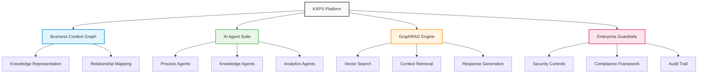

# KAPS - GenAI Adoption Framework

## Overview

KAPS (Knowledge-Augmented Processing System) is Accion's comprehensive GenAI adoption framework designed for enterprise transformation. With a significant investment of $400K in CY25, KAPS represents our flagship AI platform with projected returns of approximately $10M, delivering a 25:1 ROI ratio.

## Key Features

### Business Context Graph
Enterprise knowledge representation system that creates a comprehensive digital twin of organizational knowledge, enabling AI systems to understand business context, relationships, and dependencies across the enterprise ecosystem.

**Business Value**: Centralized enterprise knowledge for AI-driven insights, enabling more accurate and contextual AI responses.

### Process/Knowledge/Analytics Agents
Specialized AI agents designed for different business functions, including:
- Process optimization agents for workflow automation
- Knowledge management agents for information retrieval
- Analytics agents for data-driven insights

**Business Value**: Automated business process optimization and knowledge management, reducing manual effort and improving decision-making accuracy.

### GraphRAG Capabilities
Advanced retrieval-augmented generation with graph-based context understanding, leveraging knowledge graphs to provide more accurate and contextually relevant AI responses.

**Business Value**: Enhanced AI accuracy and contextual understanding, leading to better business outcomes and user satisfaction.

### Enterprise Guardrails
Comprehensive security and compliance controls specifically designed for AI deployment in enterprise environments, ensuring safe and compliant AI adoption.

**Business Value**: Safe and compliant AI adoption across enterprise, mitigating risks and ensuring regulatory compliance.

## Business Impact Metrics

| Metric | Value | Impact |
|--------|-------|--------|
| **Customer Traction** | 8 customers | $1.2M in signed deals |
| **Pipeline Strength** | 28 prospects | $6.3M active pipeline |
| **Operational Efficiency** | 90% resolution rate | for knowledge inquiries |
| **Performance Enhancement** | 60% reduction | in support response times |

## Technology Stack

- **LLMs**: Large Language Models for natural language processing
- **Vector DB**: Vector databases for semantic search and similarity matching
- **Knowledge Graph**: Graph databases for relationship mapping and context understanding
- **Azure/AWS**: Cloud infrastructure for scalable deployment

## Client Value Proposition

### Rapid GenAI Adoption
Accelerated enterprise AI transformation with proven frameworks and methodologies, enabling organizations to quickly realize the benefits of generative AI without the typical learning curve.

### Secure Deployment
Enterprise-grade security and governance features built into the platform, ensuring that AI adoption doesn't compromise organizational security or compliance requirements.

### Measurable ROI
Proven metrics and performance improvements with clear business impact measurement, allowing organizations to track and optimize their AI investment returns.

### Scalable Architecture
Growth-ready platform design that can scale with organizational needs and AI maturity, ensuring long-term value and adaptability.

## Target Industries

- **Financial Services**: Risk management, customer service automation, regulatory compliance
- **Healthcare**: Clinical decision support, patient engagement, administrative automation
- **Technology**: Product development acceleration, technical documentation, customer support

## Platform Architecture

## Investment and Returns

- **CY25 Investment**: $400K (47% of total platform investment)
- **Projected Returns**: ~$10M
- **ROI Ratio**: 25:1
- **Market Position**: Leading GenAI adoption framework with proven enterprise deployment success

## Strategic Significance

KAPS represents Accion's commitment to AI leadership and enterprise transformation. As our highest-investment platform, it demonstrates our capability to deliver comprehensive AI solutions that drive measurable business outcomes while maintaining enterprise-grade security and compliance standards.